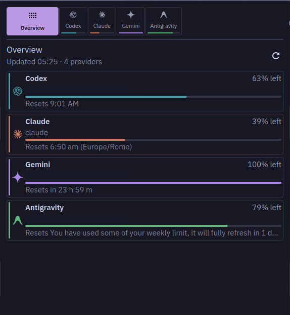
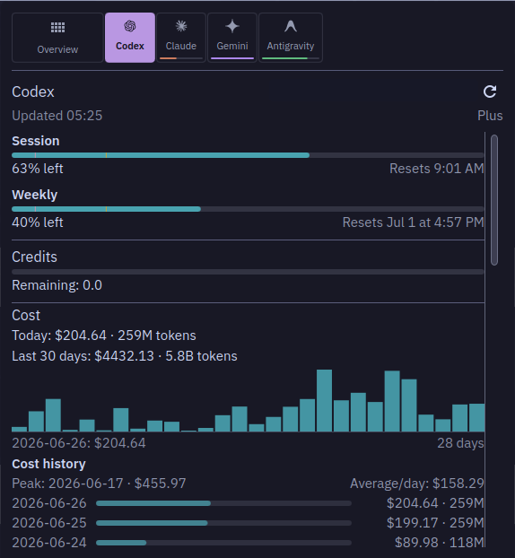

# CodexBar Plasma

KDE Plasma 6 widget for [CodexBar](https://github.com/steipete/CodexBar).
It shows AI provider usage, reset windows, costs, status, and account data in
the Plasma panel.

This repository contains only the Plasma applet. Provider logic,
authentication, configuration, quota parsing, and JSON output come from the
`codexbar` CLI.





Screenshots use one Plasma theme and accent color. The widget follows the
user's Plasma theme for text, surfaces, selection, and status colors; provider
accent colors stay stable for recognition.

## Install

1. Install the `codexbar` CLI.

   On Arch-compatible systems:

   ```sh
   yay -S codexbar-cli
   ```

   You can also install the CLI from the main CodexBar release tarballs or from
   a local Swift build.

2. Download `codexbar-plasma.plasmoid` from the
   [latest release](https://github.com/Lucenx9/codexbar-plasma/releases/latest).

3. Install the widget:

   ```sh
   kpackagetool6 -t Plasma/Applet -i codexbar-plasma.plasmoid
   ```

4. Add **CodexBar** to a Plasma panel.

To upgrade an existing install:

```sh
kpackagetool6 -t Plasma/Applet -u codexbar-plasma.plasmoid
systemctl --user restart plasma-plasmashell.service
```

To update using the bundled release helper:

```sh
make update
```

The widget can also check GitHub Releases for newer `.plasmoid` packages.
**Check for widget updates** and update-available notifications are enabled by
default; **Install widget updates automatically** is opt-in. If the widget is
published through KDE Store in the future, prefer Plasma Discover/KNewStuff for
that install channel.

## Requirements

- KDE Plasma 6
- `kpackagetool6`
- `org.kde.plasma.plasma5support`
- `codexbar` CLI on `PATH`, or an absolute CLI path configured in the widget
- `notify-send` for optional Plasma notifications

If Plasma does not inherit your shell `PATH`, set an absolute command path in
the widget settings. On Arch/CachyOS with the AUR package this is usually:

```text
/usr/bin/codexbar
```

## CLI Check

Before debugging the widget, verify the data source directly. If these commands
do not work, the Plasma widget cannot show the corresponding data.

```sh
codexbar usage --format json --json-only
codexbar usage --format json --json-only --provider codex --source oauth
codexbar usage --provider codex --all-accounts --format json --json-only
codexbar cost --format json --json-only
```

## Features

Panel and popup:

- Compact panel indicator for one provider or multiple providers.
- Provider tabs with usage bars, reset windows, account identity, status, and
  credits.
- Display modes for percent used, pace, percent plus pace, and reset time.
- Auto-select highest-usage provider for the compact panel and provider detail
  focus.
- Overview tab with per-provider usage summary and quick switching.
- Overview providers can be limited to a chosen set of up to 3 providers, or
  left automatic (the first 3 eligible providers).
- Usage dashboard summaries for provider payloads that expose API spend,
  request, token, model, or dashboard fields through the CLI.

Providers and accounts:

- Provider enable/disable controls.
- Account discovery and selection through `codexbar usage --all-accounts`.
- Provider docs, dashboards, login/account links, and redacted diagnostics.
- Descriptor-backed provider settings for CLI-advertised fields such as source,
  API key, cookie source/manual cookie, base URL, workspace/project ID, region,
  and optional usage extras.
- Provider-specific CLI command hints as a fallback when a descriptor is not
  available.

Costs and history:

- Local cost drill-down when the CLI exposes cost data.
- Token breakdowns, model summaries, recent daily spend, cost history bars, and
  average cost per 1M tokens, with a configurable cost history window.

Status and notifications:

- Provider status incident badge in the panel and provider detail view.
- Optional quota warning markers on usage bars.
- Optional Plasma notifications for provider status incidents, 80/95% quota
  crossings, and when a heavily used limit resets back to empty.

Settings:

- Split settings pages for general refresh/notification controls, display,
  advanced provider overrides, and redacted CLI diagnostics.
- Refresh presets: Manual, 1 min, 2 min, 5 min, 15 min, or custom seconds.
- Check for widget updates, notify when an update is available, and opt in to
  silent automatic widget installation.

## Troubleshooting

If the widget stays on **Loading**:

```sh
codexbar usage --format json --json-only
```

If that works in a terminal but not in Plasma, set the widget command path to
the absolute CLI path, for example `/usr/bin/codexbar`.

If providers or accounts are missing:

```sh
codexbar usage --provider codex --all-accounts --format json --json-only
```

Then check the **Providers** settings page and make sure the provider is
enabled.

If costs are missing:

```sh
codexbar cost --format json --json-only
```

Cost sections are shown only when the CLI returns cost data for the selected
provider.

If notifications do not appear:

```sh
notify-send "CodexBar" "Notification test"
```

Then confirm notifications are enabled in the widget settings.

For Plasma/QML errors:

```sh
journalctl --user -u plasma-plasmashell.service --since "10 minutes ago" --no-pager | grep -iE "codexbar|app.codexbar|qml|error"
```

## Development

Install from a local checkout:

```sh
git clone https://github.com/Lucenx9/codexbar-plasma.git
cd codexbar-plasma
kpackagetool6 -t Plasma/Applet -i .
```

Upgrade a local checkout:

```sh
kpackagetool6 -t Plasma/Applet -u .
systemctl --user restart plasma-plasmashell.service
```

Run checks:

```sh
make check
```

Update the translation template after changing user-facing `i18n` strings:

```sh
make translations
```

Package locally:

```sh
make package
```

`make check` runs the static shell checks, XML/JSON checks, and `qmllint` with
`--unqualified disable` because Plasma injects helpers such as `i18n()` as
context properties that otherwise create noisy false-positive warnings.

Project structure:

```text
metadata.json
contents/config/
contents/icons/
contents/ui/
docs/
scripts/
```

Provider support stays upstream in CodexBar. When the Plasma frontend needs new
data, add it to the CLI JSON contract first instead of scraping or editing
CodexBar config files directly from QML.

## Attribution

CodexBar Plasma is derived from the CodexBar project and uses the same MIT
license. See [NOTICE.md](NOTICE.md).
