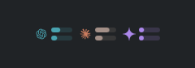
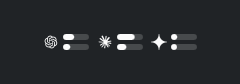
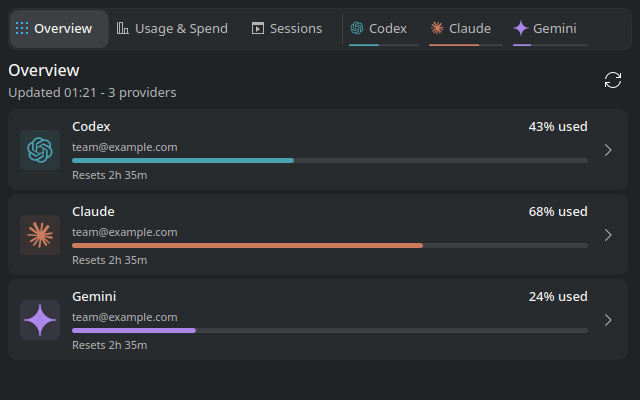
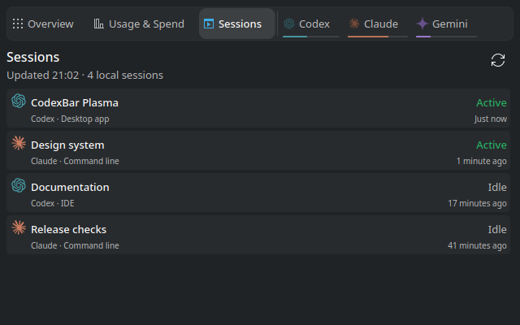
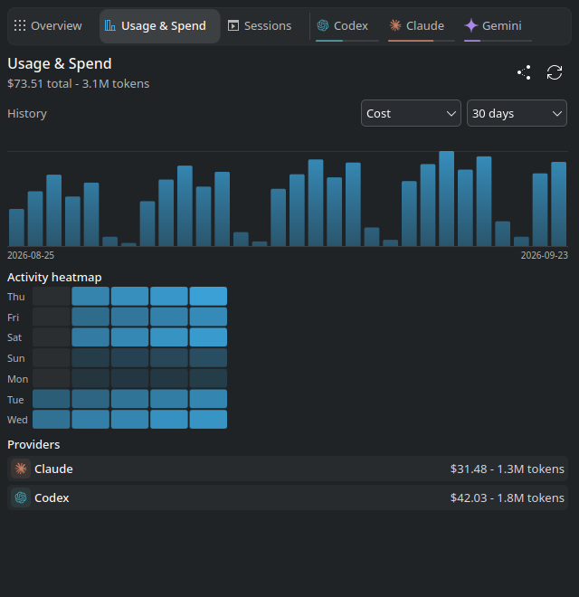
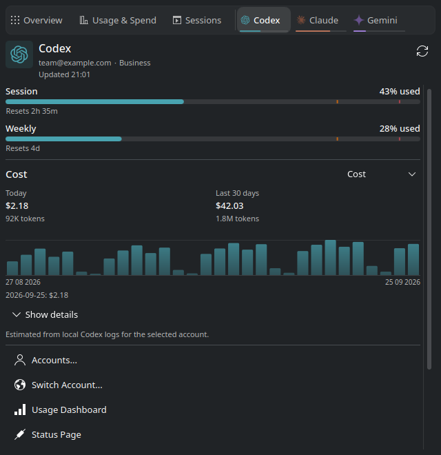

# CodexBar Plasma

KDE Plasma 6 widget for [CodexBar](https://github.com/steipete/CodexBar).
It shows AI provider usage, reset windows, costs, status, and account data in
the Plasma panel.

This repository contains only the Plasma applet. Provider logic,
authentication, configuration, quota parsing, and JSON output come from the
`codexbar` CLI.

| Standard panel | Minimal panel |
| --- | --- |
| [](docs/codexbar-plasma-panel-standard.png) | [](docs/codexbar-plasma-panel-minimal.png) |

The same Codex, Claude, and Gemini usage in both styles. Choose the appearance
in **Panel**; these examples show provider meters with panel text hidden.

| Provider overview | Local sessions |
| --- | --- |
| [](docs/codexbar-plasma-overview.png) | [](docs/codexbar-plasma-sessions.png) |
| **Usage & Spend** | **Provider details** |
| [](docs/codexbar-plasma-usage-spend.png) | [](docs/codexbar-plasma-codex.png) |

Click a screenshot to view it at full size. These captures show version 0.2.34
in Breeze Dark with synthetic accounts, usage, spend, and session data.
The widget follows the user's Plasma theme for text, surfaces, selection, and
status colors; provider accent colors stay stable for recognition.

## Install

1. Install the `codexbar` CLI from the
   [official CodexBar release tarballs](https://github.com/steipete/CodexBar/releases/latest)
   or another installation method documented by the upstream project. Third-party
   packages such as AUR can lag behind upstream releases.

2. Download `codexbar-plasma.plasmoid` from the
   [latest release](https://github.com/Lucenx9/codexbar-plasma/releases/latest).

3. Install the widget:

   ```sh
   kpackagetool6 -t Plasma/Applet -i codexbar-plasma.plasmoid
   ```

4. Add **CodexBar** to a Plasma panel.

To upgrade an existing install:

```sh
kpackagetool6 -t Plasma/Applet -u codexbar-plasma.plasmoid
systemctl --user restart plasma-plasmashell.service
```

To update using the bundled release helper:

```sh
make update
```

The helper accepts only immutable GitHub releases. It binds both release assets
to the advertised tag, checks their GitHub SHA-256 digests and published
checksum, then validates the applet id and version inside the archive before
invoking `kpackagetool6`. Any mismatch aborts the installation.

The widget can also check GitHub Releases for newer `.plasmoid` packages.
**Check for widget updates** and update-available notifications are enabled by
default; **Install widget updates automatically** is opt-in. If the widget is
published through KDE Store in the future, prefer Plasma Discover/KNewStuff for
that install channel.

## Requirements

- KDE Plasma 6
- `kpackagetool6`
- `org.kde.plasma.plasma5support`
- `codexbar` CLI on `PATH`, or an absolute CLI path configured in the widget
- `notify-send` for optional Plasma notifications
- `curl`, `jq`, `python3`, `sha256sum`, and GNU `timeout` for the bundled release
  updater; GNU `timeout` also bounds CLI writes after a secret prompt

Leave **Command path** set to `codexbar` to resolve the CLI through Plasma's
`PATH`. If the CLI works in a terminal but the widget cannot find it, locate the
binary with:

```sh
command -v codexbar
```

Then paste the returned absolute path into the widget setting.

## CLI check

Before debugging the widget, verify the data source directly. If these commands
do not work, the Plasma widget cannot show the corresponding data.

```sh
codexbar usage --format json --json-only
codexbar usage --format json --json-only --provider codex --source oauth
codexbar usage --provider codex --all-accounts --format json --json-only
codexbar cost --format json --json-only
codexbar sessions --json-v2
```

The widget keeps compatibility fallbacks for older CLI payloads. With CodexBar
0.48.1 and later it also consumes the generic `usage.details` contract for
provider-defined detail rows and bounded bar/line charts.

## Features

Panel and popup:

- Colored Standard icons with usage meters by default, for one or multiple
  providers. Provider names and percentage text can be enabled in **Panel**.
- Optional **Minimal** panel style in **Panel** uses neutral provider
  icons, thin meters in the Plasma accent color, and wider click targets.
  **Use minimal preset** also enables provider meters, including with a single
  provider, and hides panel names,
  usage text and credits. The style selector changes appearance alone, so custom
  visibility settings remain available. Quota and service warnings retain their
  semantic colors. Existing installations keep the Standard style; neither option
  changes the desktop theme, panel geometry, provider selection or popup.
- Provider tabs with usage bars, reset windows, account identity, status, and
  credits.
- Panel text modes for percent used or left, pace, usage plus pace, reset time,
  and a run-out forecast that shows the predicted duration only while the CLI
  expects the quota to run out before its reset.
- Choose the automatic, primary, secondary, or tertiary quota for panel text and
  meters in **Panel** settings. Missing quotas are omitted; popup tabs keep
  their automatic quota selection.
- Set independent visibility conditions for the full panel text and each
  provider meter: always, minimum percent used, reset within a chosen number of
  minutes, or forecast exhaustion before reset. Conditions use the displayed
  quota, respect the existing visibility checkboxes, and need no extra CLI calls.
  Missing data does not satisfy a condition. Reset conditions update each minute;
  the provider icon remains available when all conditional elements are hidden.
- Auto-select highest-usage provider for the compact panel and provider detail
  focus.
- Overview tab with per-provider usage summary and quick switching.
- Overflowing popup tabs have separate scroll buttons and immediate keyboard
  focus reveal, so navigation never covers provider labels.
- Global **Usage & Spend** tab with a Cost/Tokens selector, a 7/30/90-day range
  selector, interactive daily chart, activity heatmap, and provider totals that
  keep different currencies separate.
- Local **Sessions** tab backed by `sessions --json-v2`; transcript paths and
  working directories are never rendered or opened. The tab refreshes stale
  session data while it remains visible.
- Overview providers can be limited to a chosen set of up to 3 providers, or
  left automatic (the first 3 eligible providers).
- Usage dashboard summaries for provider payloads that expose API spend,
  request, token, model, or dashboard fields through the CLI.
- Declarative provider detail sections from the CLI `usage.details` contract,
  including labeled rows, secondary values, and keyboard/pointer-inspectable
  bar/line charts.

Providers and accounts:

- Search providers by name or ID and filter All, Enabled, or Disabled locally.
  Clear filters restores the list without changing selection or provider settings.
- Provider enable/disable and setup actions write CodexBar configuration
  immediately; Apply and Cancel cover widget settings only.
- Account discovery and selection through `codexbar usage --all-accounts`.
- Provider docs, dashboards, login/account links, and redacted diagnostics.
- With the official CLI 0.56.2 verified by this repository, the Providers page
  offers enable/disable, supported single API key setup, CLI command hints, and
  docs/dashboard/login links.
- The widget also has a renderer for the proposed
  [provider settings descriptor](https://github.com/Lucenx9/codexbar-plasma/blob/main/docs/cli-provider-settings-descriptor.md).
  CLI 0.56.2 does not expose that contract, so source, cookie, base URL,
  workspace/project, region, and other descriptor-backed editors remain
  unavailable. They require upstream CLI support.
- Generic API key setup for Fireworks, whose current CLI contract discovers the
  account slug from the key.
- Fallback names, colors, links, aliases, and icons for all 69 providers in the
  official CodexBar 0.49.1 registry; fork-only provider assets remain available
  for compatibility.

Costs and history:

- Local cost drill-down when the CLI exposes cost data.
- A compact provider summary compares today with the selected period. Expand
  details for period models, history, and projects; cost warnings remain visible.
- Click a day in the provider chart or select it with the keyboard to see that
  day's model costs and tokens. Hover previews stay inside the chart, keeping
  the layout steady. The cost/token selector reuses the loaded data.
  Missing model breakdowns and truncated lists are identified explicitly.
- Local-history scans run independently from quota refreshes, automatically at
  most once per hour; the **Usage & Spend** refresh button starts one immediately.
- Token breakdowns, model summaries, recent daily spend, cost history bars, and
  average cost per 1M tokens, with a configurable cost history window.
- Cost totals qualified as estimated, partial, or approximate from the CLI's
  bounded pricing coverage and provenance metadata.
- Project cost and token totals in **Usage & Spend**, ranked within each provider
  by the selected metric and using the same history range. The official CLI
  0.56.2 exposes project data for Codex. Missing amounts remain unavailable;
  project paths and nested source records are discarded. The bounded list
  signals omitted projects and does not change provider or global totals.
- Cost-trust notices explain why a range is incomplete or estimated. Closing a
  notice suppresses the same meaning for that provider or the aggregate Spend
  view across refreshes and popup reopenings; a materially different warning is
  shown again.

Status and notifications:

- Provider status incident badge in the panel and provider detail view.
- Optional quota warning markers on usage bars.
- Optional Plasma notifications for provider status incidents, configurable
  quota crossings, predicted quota exhaustion from CLI pace data, and when a
  heavily used limit resets back to empty.

Settings:

- Six settings pages: **General**, **Providers**, **Panel**, **Popup**,
  **Notifications**, and **Diagnostics**. CLI path and provider/source overrides
  sit beside redacted diagnostics; quota thresholds sit beside their alerts.
- A live **Panel** preview uses example data and the actual panel renderer.
  Try normal usage, near-limit usage, a service incident, or missing data before
  applying changes. The preview never fetches usage or changes saved settings.
- Optional **General → Hide personal information** hides account, organization, project,
  model and session names in the widget, its tooltips and new notifications.
  Free-form provider details are omitted; session copy actions are disabled.
  Stored data, existing clipboard contents and already-delivered notifications
  are unchanged. Provider setup and Diagnostics remain administrative surfaces.
- Optional **General → Refresh when opening the popup** refreshes stale quotas
  using the selected refresh interval, or five minutes with periodic refresh off.
  It does not scan local cost history; failed attempts use the same cooldown.
- **Popup** independently controls pace text/markers, credits/reset credits, and
  additional provider details/billing dashboards. These are visible by default;
  changing them does not refetch data or change panel metrics or alerts.
- A global, cancelable **Restore all defaults** action for user-facing widget
  settings; provider accounts and CodexBar CLI configuration are left intact.
- Usage refresh choices: no periodic refresh, 1 min, 2 min, 5 min, 15 min, or a
  custom interval. Provider service status remains opt-in.
- Configurable order for the provider identity, service status, usage text, and
  provider meters shown in the panel.
- Check for widget updates, notify when an update is available, and opt in to
  silent automatic widget installation.

### Default settings

The defaults keep quota usage visible and reserve notifications for quota warnings
and available updates. Percentages show **used** quota, matching the 80% warning
and 95% critical thresholds. Reset notifications are off until enabled.

| Setting | Default |
| --- | --- |
| Command and provider source | `codexbar` from PATH; no provider or source override |
| Usage refresh | Every 5 minutes |
| Refresh on popup opening / privacy mode | Off |
| Popup pace, credits and additional details | Shown |
| Provider service status | Off; incident notifications become active when status fetching is enabled |
| Local usage and spend history | On, 30 days, cost metric |
| Quota display | Percent used; warning markers on; thresholds at 80% and 95% used |
| Plasma notifications | On; quota warnings on; predicted exhaustion and limit-reset notices off |
| Widget updates | Check and notify every 24 hours; automatic installation off |
| Panel appearance | Standard style with colored provider icons and usage meters, including a single provider |
| Extra panel content | Provider names, usage text and credit balances off |
| Panel element order | Identity, service status, usage text, meters, respecting visibility settings |
| Panel quota and visibility | Automatic quota selection; text and enabled meters always visible |
| Provider selection | Keep the selected provider; automatic highest-usage selection off |
| Popup navigation | Tab text labels on; provider order from the CLI |
| Overview | First three enabled providers automatically |
| Reset times | Relative countdown |
| Provider changelog links | Off |

These values apply to new widgets and settings without a stored override. Existing
stored choices take precedence. **General → Restore all defaults** prepares these
values for an existing widget; select **Apply** or **OK** to save them, or **Cancel**
to keep its settings. Provider accounts and CLI configuration are not reset.

## Troubleshooting

If the widget stays on **Loading**:

```sh
codexbar usage --format json --json-only
```

If that works in a terminal but not in Plasma, run `command -v codexbar` and
paste the returned absolute path into the widget setting. Use **Use PATH** to
return to the portable `codexbar` default after changing installation method.

If providers or accounts are missing:

```sh
codexbar usage --provider codex --all-accounts --format json --json-only
```

Then check the **Providers** settings page and make sure the provider is
enabled.

If costs are missing:

```sh
codexbar cost --format json --json-only
```

Cost sections are shown only when the CLI returns cost data for the selected
provider.

If notifications do not appear:

```sh
notify-send "CodexBar" "Notification test"
```

Then confirm notifications are enabled in the widget settings.

For Plasma/QML errors:

```sh
journalctl --user -u plasma-plasmashell.service --since "10 minutes ago" --no-pager | grep -iE "codexbar|app.codexbar|qml|error"
```

## Languages

The widget includes Italian, French, German, Spanish, and Brazilian Portuguese
translations. It uses your Plasma language preferences and falls back to English
for other languages.
Provider names and text supplied by the CLI retain their original language.

To add or improve a translation, see the
[translation guide](https://github.com/Lucenx9/codexbar-plasma/blob/main/docs/translations.md).

## Development

Install from a local checkout:

```sh
git clone https://github.com/Lucenx9/codexbar-plasma.git
cd codexbar-plasma
make install
systemctl --user restart plasma-plasmashell.service
```

Upgrade a local checkout:

```sh
./install.sh
```

Both paths build and install the curated `.plasmoid` archive; repository-only
files such as tests and agent instructions are not copied into the installed
applet.

Run checks:

```sh
make check
```

Run the popup smoke test from a graphical Plasma 6 session:

```sh
make smoke
```

This requires Python 3, GNU gettext, `plasmawindowed`, `dbus-run-session`, and the Plasma,
Kirigami, and KDE desktop control QML modules. README captures also require the
Breeze Dark color scheme. The localized scenarios use
the UTF-8 locales listed in the translation guide; CI generates them during
setup. The runner opens a temporary applet for
each scenario, captures the view, and closes the preview automatically:

| Scenario | Captured state |
| --- | --- |
| `normal` | Overview with synthetic Codex and Claude quotas. |
| `readme-overview`, `readme-spend`, `readme-sessions`, `readme-codex` | README gallery in Breeze Dark, with three providers, varied 30-day history, and four local sessions. |
| `readme-panel-standard`, `readme-panel-minimal` | Standard and Minimal panel icons and usage meters, with identical three-provider data in Breeze Dark. |
| `tabs-overflow` | Ten providers, with scroll-button geometry, immediate focus reveal, and endpoint states checked. |
| `provider-settings` | Enabled-only settings list, after checking combined search/filter behavior and selection isolation. |
| `provider-header`, `provider-header-large` | Provider identity and incident badge at normal and doubled body text sizes. |
| `settings-general`, `settings-panel` | General defaults and the live Panel preview, including pending settings, scenarios and effect isolation. |
| `settings-popup`, `settings-notifications`, `settings-diagnostics` | Popup options, thresholds/alerts and idle diagnostics with synthetic data. |
| `popup-content` | Hide and restore pace, credits and provider details without fetching or changing notifications. |
| `refresh-on-open` | Default/fresh openings stay idle; an opt-in stale opening refreshes usage only. |
| `privacy-provider`, `privacy-spend`, `privacy-sessions` | Hide synthetic identities across views while retaining metrics, account keys and snapshots; session copying is disabled. |
| `loading` | Initial loading while the fixture CLI waits. |
| `partial-error` | Claude's error view while healthy Codex data remains available. |
| `long-text` | Codex with long account and workspace labels, two accounts, and doubled body text. |
| `panel-rules` | Compact panel with secondary quotas after checking conditional visibility and defaults. |
| `panel-default`, `panel-default-single` | Fresh Standard defaults with two providers or one, preserving explicit text/meter preferences and the icon fallback. |
| `panel-standard`, `panel-minimal` | Same synthetic provider meters in both styles, with the real Panel preset and configuration isolation checked. |
| `panel-minimal-single` | Minimal with one provider, including meter visibility, missing quotas, and Standard fallback. |
| `legacy-dashboard` | Legacy dashboard zeroes and formatted rows, with generic details taking precedence when present. |
| `project-costs` | Project estimates, an explicit zero, and an unavailable cost in Usage & Spend. |
| `project-tokens` | Switching to tokens reorders projects without reloading history. |
| `popup-cost-details`, `popup-cost-tokens` | Compact provider summary, daily versus period models, absent model data, expansion, and metric changes without reloading history. |
| `project-range` | Switching to 7 days removes the old range before the new project totals arrive. |
| `project-long-text` | Project names wrap with doubled body text. |
| `localization-it`, `localization-fr`, `localization-de`, `localization-es`, `localization-pt_BR` | Translated overview, with catalog loading, plural forms, and a settings label checked in each language. |

Select one scenario or choose a new artifact directory:

```sh
make smoke SMOKE_ARGS='--scenario long-text'
python3 scripts/smoke_popup.py --scenario normal --output /tmp/codexbar-preview
python3 scripts/smoke_popup.py --scenario panel-minimal --renderer opengl
python3 scripts/smoke_popup.py --scenario readme-overview --renderer opengl --output /tmp/codexbar-readme
```

Use `--renderer opengl` on a graphical session with OpenGL for accurate provider
icon colors. The default software renderer checks layout and behavior, but does
not render Kirigami's icon color masking. Qt documents the software renderer's
[effect limitations](https://doc.qt.io/qt-6/qtquick-visualcanvas-adaptations-software.html).

The command prints the artifact directory, defaulting to `dist/smoke/run-*`.
Each scenario produces a PNG and a process log; `results.json` records pass or
failure. Existing output directories are never overwritten. The timeout is
30 seconds per scenario and can be changed with `--timeout 60`.

The runner copies the current applet into temporary XDG directories under a
separate applet ID and uses a private D-Bus session. It sets a synthetic CLI
path and disables updates and notifications before QML starts. It does not
install a package, use real provider accounts, change the installed widget's
settings, or restart Plasma. Temporary files and preview processes are removed
on completion, timeout, or interruption.

The capture component selects the real popup views and waits for the expected
state before using Qt's
[`grabToImage`](https://doc.qt.io/qt-6/qml-qtquick-item.html#grabToImage-method).
The `panel-rules` scenario exercises quota selection, visibility conditions,
checkboxes, and clock changes in the real applet, then captures its compact
representation. The `tabs-overflow` scenario walks the tab focus chain and
checks immediate reveal. The `provider-settings` scenario captures the real
settings page after exercising local filters. Popup captures include their
theme background. QML errors,
missing captures, early exits, and timeouts fail the command. The screenshots
still need visual review: this is not a pixel-comparison test, and it does not
exercise panel placement, key-event dispatch, or the real CLI. Synthetic
payloads cover a small subset of the repository's CLI 0.56.2 contract; dates
are relative to the run time. Typography uses Noto Sans and the Breeze icons.

`make check` covers the runner's portable isolation and failure-handling tests
and lints the capture QML.
`make smoke` additionally requires the graphical environment and reports a
failure rather than silently skipping when that environment is unavailable.

Update the translation template after changing user-facing `i18n` strings:

```sh
make translations
```

After extracting strings, update the `.po` catalogs with `msgmerge` and translate
new entries as described in the translation guide. `make check` rejects missing
translations, fuzzy entries, and changed `%1` placeholders.

Package locally:

```sh
make package
```

Packaging requires Python 3 and GNU gettext. It compiles `po/*.po` into
`contents/locale/<language>/LC_MESSAGES/plasma_applet_app.codexbar.plasma.mo`
and includes those catalogs in the archive. Generated `.mo` files are not committed.

`make check` runs ShellCheck, the static regression checks, the Qt tests,
XML/JSON validation, and `qmllint`. When `kpackagetool6` is available, it also
validates the AppStream metadata; otherwise, it reports that the check was
skipped. The command passes `--unqualified disable` to `qmllint` because Plasma
injects helpers such as `i18n()` as context properties that otherwise create
noisy false-positive warnings.

CI installs the Plasma, Kirigami, and KDE desktop control modules and rejects
skipped Qt tests. Import and type warnings fail the check. A separate smoke job
runs the real popup scenarios under Xvfb and saves screenshots and logs as
workflow artifacts. Releases require both jobs to pass.

Older Plasma packages register some applet types only at runtime. On machines
without their QML type metadata, `make check` reports partial import/type
checks. CI supplies that metadata through its pinned image. To require the
same checks locally, run:

```sh
QML_TEST_REQUIRE_NO_SKIPS=1 make check QMLLINT_FLAGS='--import warning --unqualified disable'
```

Project structure:

```text
metadata.json
contents/config/
contents/icons/
contents/ui/
docs/
scripts/
```

Provider support stays upstream in CodexBar. When the Plasma frontend needs new
data, add it to the CLI JSON contract first instead of scraping or editing
CodexBar config files directly from QML.

## Attribution

CodexBar Plasma is derived from the CodexBar project and uses the same MIT
license. See [NOTICE.md](NOTICE.md).
