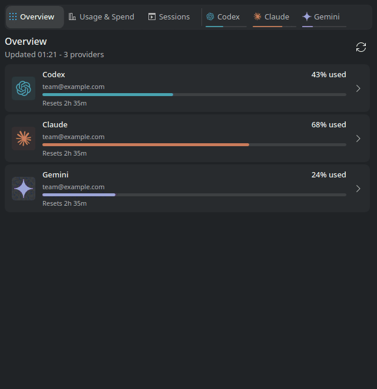

# CodexBar Plasma

Track Codex, Claude, Gemini, and 70+ more AI providers from your KDE Plasma 6
panel. Quotas, reset windows, costs, local agent sessions, notifications, and
multiple accounts per provider.

[Install](#install) · [Features](#features) · [Troubleshooting](#troubleshooting) · [Development](#development)



The current popup in Breeze Dark with synthetic data. The widget follows your Plasma
theme; provider accent colors stay consistent across themes.

## Install

### Quick install from a terminal

From your Plasma 6 desktop session, run this command as your regular user:

```sh
(installer=$(curl -fsS --max-time 30 --max-filesize 65536 https://raw.githubusercontent.com/Lucenx9/codexbar-plasma/main/scripts/update-widget.sh) && bash -c "$installer" codexbar-setup --setup)
```

This downloads the installer from this repository's `main` branch before
executing it. The installer script stays in the current shell's memory; no
script file is created. To inspect it first, download the URL above to a file
you choose and run that file with `bash FILE --setup`. The installer downloads
the latest stable **release package**, verifies its GitHub SHA-256 digests,
published checksum, applet ID and version, and installs or updates it for your
user. No Git checkout or build is needed. Run it without `sudo`; missing
command-line dependencies are reported before installation. The
[runtime requirements](#requirements) still apply.

If `codexbar` is absent from your terminal's PATH, setup offers to install or
reuse a private official CLI. Then add **CodexBar** through **Add Widgets**,
open **General → Managed CLI → Use managed CLI**, and **Apply**. Existing CLI
installations and provider credentials are preserved. Configure your providers
in the widget's **Providers** settings using the supported setup actions.

Rerunning the command upgrades an older widget and offers to restart Plasma.
Prompts default to No; without a terminal they are skipped. For unattended setup,
add `--no-input` after `--setup` in the command; add `--with-cli` to explicitly
install or reuse the private CLI too. Selecting it in widget settings is still
required. A CLI failure leaves the widget installed and returns a nonzero status.

### KDE Store or manual installation

1. Install the Linux CLI from the
   [official CodexBar release tarballs](https://github.com/steipete/CodexBar/releases/latest)
   or another method documented by [upstream CodexBar](https://github.com/steipete/CodexBar).
   Third-party packages such as AUR can lag behind upstream releases.
   Alternatively, install the widget first and use **General → Managed CLI →
   Install and select managed CLI**, then **Apply**. This downloads an official
   Linux binary to a private directory without replacing a system installation.
   Use the resolved path from **Diagnostics → Check versions** for terminal commands.
   Set up your provider using the upstream instructions, then verify usage:

   ```sh
   codexbar usage --format json --json-only
   ```

2. Install the widget. From your panel, open **Add Widgets → Get New Widgets →
   Download New Plasma Widgets**, search for **CodexBar**, and install it from
   the [KDE Store](https://store.kde.org/p/2370789/).

   Or download `codexbar-plasma.plasmoid` from the widget's
   [latest release](https://github.com/Lucenx9/codexbar-plasma/releases/latest)
   and run, in the directory containing that file:

   ```sh
   kpackagetool6 -t Plasma/Applet -i codexbar-plasma.plasmoid
   ```

   The GitHub release is the newest package; a store listing can trail it. The
   widget's own update check always follows GitHub releases.

3. Open your Plasma panel's **Add Widgets** chooser and add **CodexBar**.

4. Open the widget settings. Use **Providers** to enable providers and supported
   setup actions, **Panel** to adjust the compact display, and **General** to
   choose refresh and privacy settings.

Provider enable/disable and setup actions change the CLI configuration
immediately. **Apply** and **Cancel** cover widget settings only.

New widgets refresh quotas every five minutes, refresh again when you open the
popup on quotas older than that interval, and show percent **used**. Warning
and critical thresholds default to 80% and 95%. Existing settings are preserved
when you upgrade.

Failed refreshes retain quotas measured within the last 24 hours and identify
them as last known.
A redacted cache restores recent quotas after a Plasma restart while the CLI
refreshes. See [data freshness](https://github.com/Lucenx9/codexbar-plasma/blob/main/docs/usage.md#data-freshness)
for its limits.

## Requirements

- KDE Plasma 6, `kpackagetool6`, and the `org.kde.plasma.plasma5support` QML module.
- `QtQuick.Dialogs` and KDE Declarative's `org.kde.kquickcontrolsaddons` QML
  modules for the local usage-sharing window, file picker, and image clipboard.
- A working `codexbar` CLI, available on Plasma's `PATH` or through an absolute
  path configured in the widget, including its optional managed copy. Managed
  downloads support Linux x86_64/aarch64 with glibc or musl; the downloaded
  executable must pass a local version probe before activation.
- `notify-send` for Plasma notifications.
- Optional AI Insights only: `python3` and GNU `timeout`; for OpenRouter or
  OpenAI keys also `kdialog`, `secret-tool`, and a Secret Service provider such
  as KWallet. Nothing is required while the feature is off.
- `curl`, `jq`, `python3`, `sha256sum`, GNU `timeout`, and util-linux `flock` for
  the bundled release updater. CLI release checks and managed installs also use `python3` and GNU `timeout`. GNU `timeout`
  also bounds CLI writes after a secret prompt.

Distribution package names vary. Source builds additionally need `make`, Python
3, and GNU gettext; see [Development](#development).

## Features

Share a local usage summary from **Usage & Spend** as a PNG or copied text.
The preview includes the selected history range, token totals, estimated usage
costs, providers, and top models, with a small repository attribution. See [usage sharing](https://github.com/Lucenx9/codexbar-plasma/blob/main/docs/usage.md#share-usage).

| Standard panel | Minimal panel |
| --- | --- |
| [](docs/codexbar-plasma-panel-standard.png) | [](docs/codexbar-plasma-panel-minimal.png) |

The same Codex, Claude, and Gemini usage in both styles. Small provider icons
sit beside primary and secondary quota capsules. Choose the appearance in
**Panel** settings. These examples show meters with panel text hidden.

| Provider overview | Local sessions |
| --- | --- |
| [](docs/codexbar-plasma-overview.png) | [](docs/codexbar-plasma-sessions.png) |
| **Usage & Spend** | **Provider details** |
| [](docs/codexbar-plasma-usage-spend.png) | [](docs/codexbar-plasma-codex.png) |

The popup captures are the full-size stills behind the animation above. Click an
image to open it. Panel captures show the capsule design released in 0.2.36;
popup captures show the current popup. All use Breeze Dark with synthetic data. The
widget follows your Plasma theme; provider accent colors stay consistent across
themes.

- Quota meters, reset windows, account selection, and provider status in the panel
  and popup, with configurable quota warnings and Plasma notifications.
- Standard and Minimal panel styles with up to two quota capsules per provider,
  horizontal and vertical meters, selectable quota windows, conditional text
  and meters, and a live settings preview that stays visible while scrolling.
  Optional text sits beside the selected
  provider's capsules with the default order. Panel settings keep appearance and
  meters visible; additional information and quota/order/visibility options expand
  when needed.
- **Usage & Spend** with cost/token charts, a 7/30/90-day range, an activity
  heatmap, and provider, model, and project breakdowns when the CLI supplies them.
- A local **Sessions** tab. Transcript paths and working directories are never
  displayed or opened.
- Refresh on popup opening, plus optional privacy mode and automatic widget updates.
- Optional, off-by-default [AI Insights](https://github.com/Lucenx9/codexbar-plasma/blob/main/docs/usage.md#ai-insights):
  a short summary in Overview from a local Ollama model, OpenRouter, or OpenAI,
  written in the widget's interface language from aggregated statistics only.
- English plus Italian, French, German, Spanish, and Brazilian Portuguese,
  selected through your Plasma language preferences.

Provider authentication and data support come from the CLI. The widget includes
fallback metadata for all 80 providers in the official CodexBar 0.65.0 registry,
covering names, icons, and documentation links, with brand colors and dashboard
and status links where upstream defines them. Available metrics and setup
actions vary by provider. The proposed generic provider-settings descriptor is
not available in CLI 0.65.0; its additional editors remain unavailable.

<!-- Web links to guides also work in the installed package, which omits those files. -->
See the [usage and settings guide](https://github.com/Lucenx9/codexbar-plasma/blob/main/docs/usage.md)
for options and defaults, the [documentation index](https://github.com/Lucenx9/codexbar-plasma/blob/main/docs/README.md)
for verified CLI evidence, and [Linux parity TODO](https://github.com/Lucenx9/codexbar-plasma/blob/main/TODO.md)
for remaining Linux/Plasma work.

## Update

Read the [changelog](CHANGELOG.md) for changes and upgrade notes by version.

To upgrade a release installation, download the new `.plasmoid` and run:

```sh
kpackagetool6 -t Plasma/Applet -u codexbar-plasma.plasmoid
```

Log out and back in to load the new widget code, or reload your Plasma panels
and desktop with:

```sh
systemctl --user restart plasma-plasmashell.service
```

In **General → Updates**, **Check for widget updates** and update notifications
are enabled by default. Clicking an update notification opens that release's
page on GitHub where the installed `notify-send` supports notification actions.
**Install widget updates automatically** is opt-in.

The widget-update helper accepts only immutable GitHub releases. It binds assets to
the advertised tag, verifies SHA-256 digests and the published checksum, and
checks the applet ID and version before installation. A validation mismatch
aborts the update.

**General → CLI updates** offers a manual check of official CodexBar releases
and optional daily checks, off by default. Notifications can be enabled separately.
These announce upstream releases, not package-manager availability. AUR and other
package users should update through their existing package tools; the widget
never replaces their CLI. Recognized ownership includes pacman, dpkg, RPM, APK,
and Homebrew. Unrecognized installations keep their original update method.
**Diagnostics → Check versions** stays offline and reports the installed CLI,
resolved command, and recognized installation manager.

**General → Managed CLI** can install and select a separate private CLI, update
it immediately, or restore its previous version. An existing managed copy can be
selected offline with **Use managed CLI**. **Automatically update the
managed CLI daily** is optional and off by default; it acts only while the
managed command path is selected. Downloads match the host architecture/libc,
verify GitHub SHA-256 metadata and the published checksum, and switch atomically
after a version probe. A restored version stays selected until a newer release
arrives or you explicitly update again. See [managed CLI details](https://github.com/Lucenx9/codexbar-plasma/blob/main/docs/usage.md#managed-cli).

For a source checkout, see the [development update commands](https://github.com/Lucenx9/codexbar-plasma/blob/main/docs/development.md#work-from-a-checkout).
The source-checkout helper `./install.sh` checks for `kpackagetool6` and
`systemctl` before building, then installs the package and restarts Plasma.

## Troubleshooting

### The widget stays on Loading or cannot find the CLI

Usage errors in the popup offer **Retry** and **Settings**. Open **Diagnostics**
in widget settings to check the connection. Retry is unavailable while a quota
refresh is running; the last known quotas stay visible when available.

If the popup says **CodexBar CLI not found**, Plasma could not run the
configured command at all, so there is nothing to retry. Set an absolute path as
described below. **Diagnostics → Check versions** reports the widget and CLI
versions and the absolute command the shell resolved.

Run `codexbar usage --format json --json-only` in a terminal. If it fails,
resolve the provider or CLI setup first. If it works, locate the executable:

```sh
command -v codexbar
```

Paste the returned absolute path into **Diagnostics → Command path**. Plasma
may have a different `PATH` from your terminal. **Use PATH** restores the
portable `codexbar` default.

### Providers, accounts, or costs are missing

If the popup has no provider data, choose **Configure providers**, then open
**Providers** in widget settings to enable or set up a provider.

Check that the provider is enabled in **Providers**, then inspect the relevant
CLI response. For example, for Codex accounts and local cost data:

```sh
codexbar usage --provider codex --all-accounts --format json --json-only
codexbar cost --format json --json-only
```

The widget can display only data the CLI returns. Cost availability varies by
provider; missing dollar amounts do not mean zero spend. If a feature is absent,
check the [usage guide](https://github.com/Lucenx9/codexbar-plasma/blob/main/docs/usage.md)
and [Linux parity TODO](https://github.com/Lucenx9/codexbar-plasma/blob/main/TODO.md).

### Notifications do not appear

Check the widget's **Notifications** settings and test desktop notifications:

```sh
notify-send "CodexBar" "Notification test"
```

### Report a problem

[Open a widget issue](https://github.com/Lucenx9/codexbar-plasma/issues/new/choose)
and complete the form: reproduction steps, expected and actual behavior, your
distribution, and the Plasma, widget, and CLI versions. Report a suspected
vulnerability privately through the
[security policy](https://github.com/Lucenx9/codexbar-plasma/blob/main/SECURITY.md)
instead of opening an issue. For QML errors, inspect recent logs:

```sh
journalctl --user -u plasma-plasmashell.service --since '10 minutes ago' --no-pager
```

Include only relevant CodexBar errors. Redact account details, paths, credentials,
and other personal information before sharing logs or screenshots. If the CLI
command itself fails, consult [upstream CodexBar](https://github.com/steipete/CodexBar)
for provider setup and CLI support.

## Development

Build and install from a checkout:

```sh
git clone https://github.com/Lucenx9/codexbar-plasma.git
cd codexbar-plasma
make install
```

Then reload Plasma as described under [Update](#update).
Run `make check` before submitting changes. The
[development guide](https://github.com/Lucenx9/codexbar-plasma/blob/main/docs/development.md)
covers dependencies, checks, isolated popup smoke tests, packaging, and QML
conventions. See the [documentation index](https://github.com/Lucenx9/codexbar-plasma/blob/main/docs/README.md)
for maintained references.

Contributions to the Plasma widget are welcome through
[pull requests](https://github.com/Lucenx9/codexbar-plasma/pulls). Read
[CONTRIBUTING.md](https://github.com/Lucenx9/codexbar-plasma/blob/main/CONTRIBUTING.md)
first and include the verification results requested by the PR template. Provider logic and CLI
contracts belong upstream. To add or improve a language, follow the
[translation guide](https://github.com/Lucenx9/codexbar-plasma/blob/main/docs/translations.md).
CLI-supplied free-form text retains its original language.

## Support

If CodexBar Plasma saves you time, you can
[support development on Ko-fi](https://ko-fi.com/lucenx9). The same link is in
the repository's **Sponsor** button.

## License and attribution

CodexBar Plasma is derived from [CodexBar](https://github.com/steipete/CodexBar)
and distributed under the [MIT License](LICENSE). See [NOTICE.md](NOTICE.md) for
attribution.
