# Popup visual review

The review started with the installed widget in the current Plasma theme.
These comparisons render the repository at `07bdf8d` and the proposed changes
in `plasmawindowed`, using identical synthetic provider and cost snapshots.
They contain no live accounts or usage data.

| Before | After | Change |
| --- | --- | --- |
|  |  | Rows size to their content, with more padding and a chevron that indicates navigation. |
|  |  | Account and plan share an identity line; the update time has its own line. |
|  |  | History filters have their own row, leaving room for the total. |

Every popup refresh action uses the native button's footprint while displaying
a busy indicator. Overview rows show an explicit keyboard focus outline and
clear it when the user switches to the mouse. Direct QtTests cover activation,
busy state sizing, focus changes, and account visibility after reopening.

The design follows the existing Plasma colors, fonts, and spacing units. The
Emil design engineering and Apple design skills informed grouping, hierarchy,
and immediate feedback. No CLI contract or persisted setting changes.

The light-theme check uses Breeze Light, a 14-point body font, and a 12-point
small font in an isolated preview configuration.

## Settings

The same review covers General, Providers, and Display. These screenshots use
an isolated Plasma configuration and the same synthetic roster of four enabled
and two disabled providers. Provider loading is replaced only in the temporary
preview package. No provider credentials or live account data are included.

| Before | After | Why |
| --- | --- | --- |
|  |  | Bound supporting text lets the native form place labels beside controls when space permits. Notifications and update options indent beneath their parent setting. The history window includes its day unit. |
|  |  | Settings and diagnostics start collapsed, making all four enabled example providers visible. Provider links and the immediate-save notice remain available. |
|  |  | Provider icons replace inactive drag handles. Panel visibility controls precede ordering, arrow buttons have tooltips, and help describes only the selected text mode. |

The General form was checked at frame widths of 690, 818, and 1100 pixels.
It switches to stacked labels in a narrow window, while supporting text wraps
inside the form. The Defaults explanation no longer extends beyond the page.

The additional light-theme check uses a 14-point body font and 12-point small
font. The settings disclosure follows the user's body font.

[Providers with larger text in Breeze Light](settings-providers-large-text-light.png)

Provider disclosure and selection, and provider reordering were exercised in
the preview. An injected diagnostic error survived collapsing and reopening
the details. Opening details does not fetch diagnostics. The disclosure is a
native checkable control and retains the existing CLI-backed options and
redacted diagnostics behind it. No configuration schema or CLI contract changed.

## Panel, empty states, and Debug

This additional comparison uses commit `74558da` as its before state. It renders
the actual QML components with identical synthetic fixtures in `plasmawindowed`.
The panel gallery uses horizontal rows of 24, 32, and 48 logical pixels, a vertical
representation, and a loading row. The chart deliberately supplies a long value
and label at the final point of a narrow plot.

| Before | After | Why |
| --- | --- | --- |
| 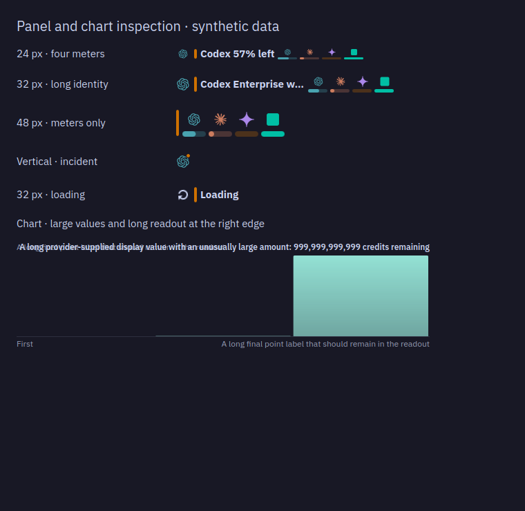 | 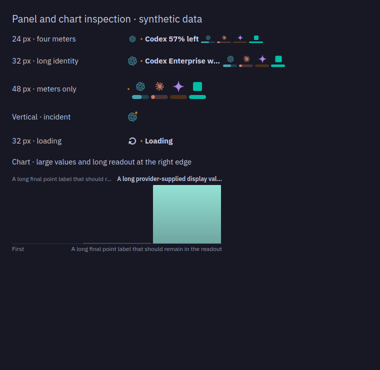 | The incident dot remains square and centered instead of stretching with the panel. Long chart values elide within their allotted width and preserve the point label. |
| 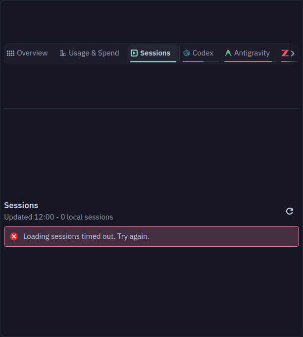 | 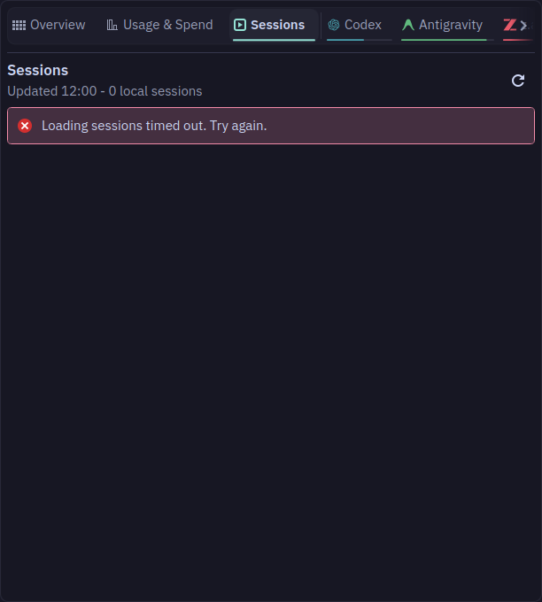 | An empty error state absorbs the remaining height, keeping tabs, the heading, and refresh at the top. The same correction covers an initial CLI error. |
| 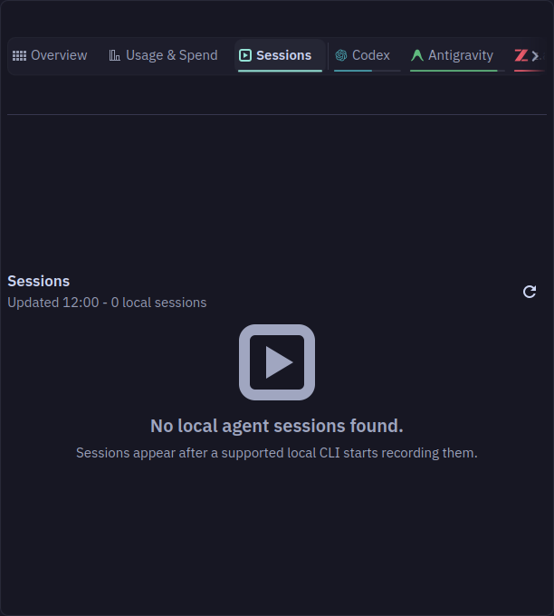 | 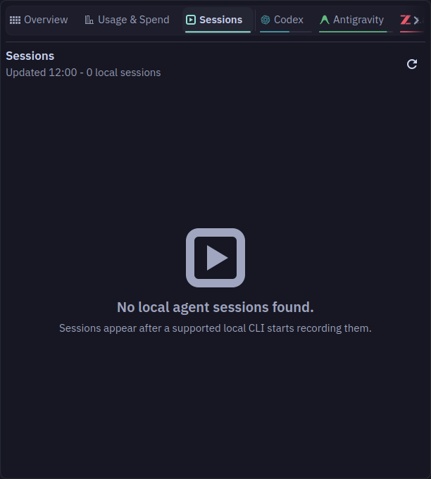 | A containing item fills the view while the native placeholder retains its natural size. This also fixes empty provider and Usage & Spend views. |
| 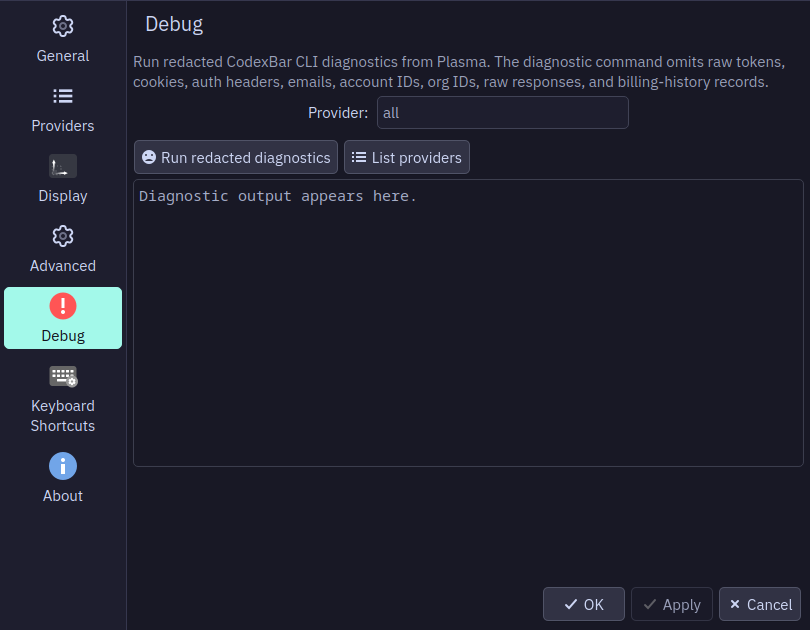 | 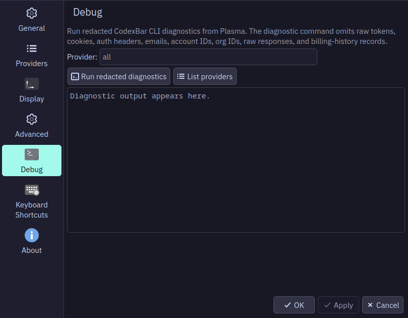 | The provider filter aligns with its actions and output. A terminal icon identifies diagnostics without implying an active error. The field retains an accessible label. |

The empty-state wrappers preserve the grouped icon, message, and explanation;
stretching the Kirigami placeholder itself would separate those elements.
[Empty providers](edge-empty-providers-after.png) and
[empty Usage & Spend](edge-spend-empty-after.png) use the same layout rule.

| Check | Result |
| --- | --- |
| Panel composition | Inspected icon/text/meter combinations, four providers, long text, loading, and incidents at the sizes above. |
| Fractional scaling | Inspected isolated Qt render scales of 125% and [150%](edge-panel-chart-150-after.png), without changing the host display scale. |
| Many provider tabs | Traversed 16 providers with native arrow-key input, then selected the final long-name tab with Space. The focused tab scrolls into view and retains its focus outline: [screenshot](edge-tabs-keyboard-after.png). |
| Sessions | Checked empty, loading, timeout, and [25 long-name sessions](edge-sessions-long-after.png). Names elide and the list scrolls vertically. |
| Usage feedback | Checked no data, initial loading, missing CLI, partial provider failure with retained data, and unavailable local cost history. |
| Settings | Checked Debug and Advanced in the native window. Advanced needed no change. Earlier General, Providers, and Display comparisons remain above. |
| Direct interaction checks | QtTests cover meter activation by keyboard and pointer, chart keyboard and pointer inspection, empty chart selection, the three panel dot sizes, and the Sessions heading in empty/loading/error states. |

The new tests reproduced five failures against the previous code (three panel
sizes, chart overflow, and Sessions error layout). At this stage `make check` passed
550 QtTests and 3 desktop-style checks with no failures or skips. QML lint,
ShellCheck, static checks, catalog validation, and AppStream validation pass.
Packaging and the installed-widget runtime check are recorded in the PR.

`plasmoidviewer` is unavailable on this host. This first panel pass used
the actual compact component in the native gallery. The additional live-panel
checks are recorded below. The native checks supplement the earlier light
theme and larger-text comparisons; no claim is made about every Plasma theme.

## Accounts and Settings keyboard navigation

This comparison starts at `853acef`. It uses the same design skills and native
Plasma controls as the earlier passes. The account and provider fixtures remain
synthetic. Settings uses an isolated preview package with mocked roster loading.
The three fixes belong to the account panel, provider settings rows/page, and
Display ordering controls; they do not change the config schema or CLI payloads.

| Before | After | Why |
| --- | --- | --- |
| 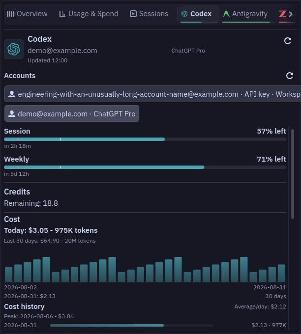 | 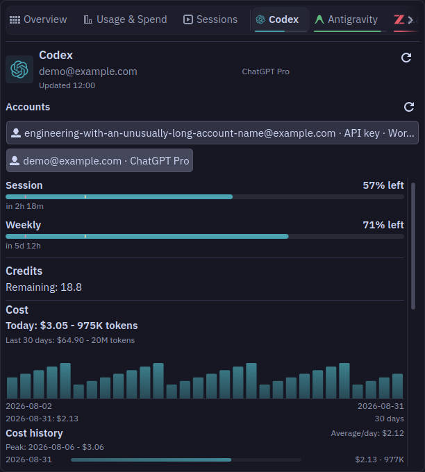 | Bound the account button to the popup width and elide its label. Keep the full account and workspace text in its accessible name and tooltip. |
| 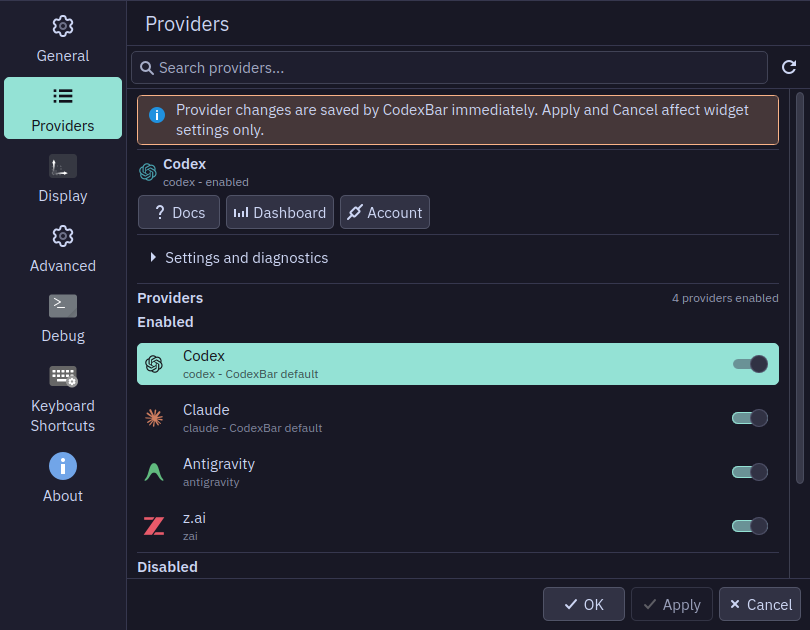 | 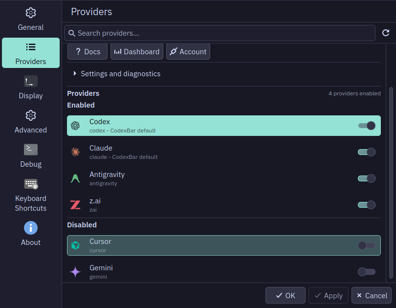 | Provider rows now accept keyboard focus and Space selects their settings without changing enablement. The page scrolls focused rows and controls into view. Previously the disabled-provider switch received focus below the viewport. |
|  | 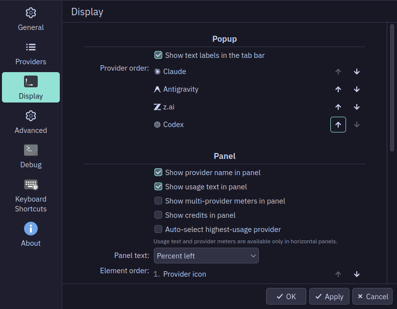 | Reordering recreated delegates and lost focus after one move. Restore focus by provider or panel-element identity, choosing the available direction at an edge. The after view shows three consecutive Space presses with focus retained. |

The account tooltip also opens on keyboard focus:

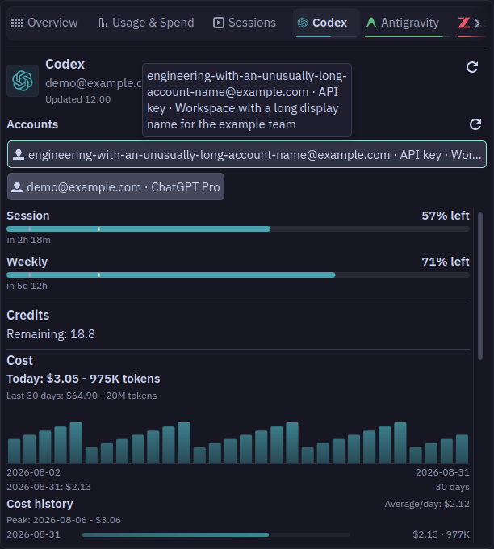

Panel element reordering uses the same focus restoration. After layout places a
rebuilt row, the focused arrow remains inside the scroll viewport:

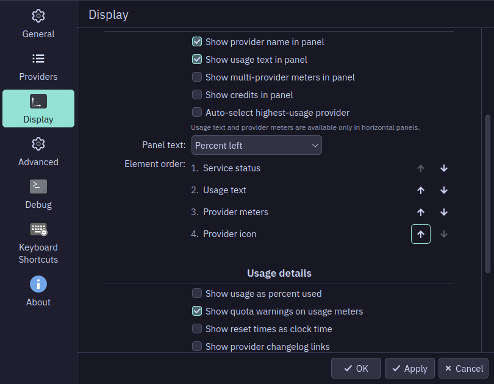

| Native keyboard check | Result |
| --- | --- |
| General | Tab/Shift+Tab navigation, native checkbox and combo input, scrolling, and Apply worked. Applying a preview setting returned Apply to its disabled state. |
| Providers | Rows, separate enable switches, disclosure, search, reload, and actions were reachable. Space selected a disabled provider without enabling it. Focused lower rows scrolled into view. |
| Display | Repeated provider and panel-element moves retained the focus outline. At the last row focus moved to the enabled up arrow. The focused control stayed visible after layout. |
| Advanced and Debug | Fields and buttons were keyboard reachable with native focus feedback. Diagnostics were not run. |
| Credential dialog | The actual API-key action opened the native masked-input dialog. Dummy input remained masked; Escape canceled and returned the action to its enabled state. No key was saved. |
| Unsaved settings | Native confirmation appeared on page navigation. Escape canceled navigation; Discard then opened the requested page. |

[Masked credential dialog](interaction-credential-dialog.png) ·
[Unsaved-settings confirmation](interaction-settings-confirmation.png)

The new QtTests reproduced three failures against `853acef`: account overflow
at 240 and 540 logical pixels, and keyboard selection of a provider row. All
three pass after the fixes, including full account identity preservation and
the separate enable switch. Static checks guard the page-owned focus/scroll
wiring; native keyboard checks cover ordering after delegate replacement.
Final verification passes **553 QtTests and 3 desktop-style checks**, with no
failures or skips, plus the remaining `make check` gates. Packaging and local
package upgrade passed. The installed widget opened successfully and its runtime
log and recent Plasma logs contained no matching QML errors.

## Real panel popup placement

A temporary panel hosted a synthetic copy of the actual widget in the running
Plasma shell. The [Plasma scripting API](https://develop.kde.org/docs/plasma/scripting/api/)
positioned only that temporary panel. Native input opened the popup at all four
screen edges and opposite horizontal alignments. The available screen was
1920 × 1080 at scale 1; the temporary panel was 36 pixels thick.

| Panel placement | Popup bounds (x, y, width, height) | Result |
| --- | --- | --- |
| Top, left aligned | 0, 36, 620, 413 | Inside the screen |
| Top, right aligned | 1300, 36, 620, 413 | Inside the screen |
| Right, top aligned | 1263, 0, 621, 412 | Inside the screen |
| Bottom, right aligned | 1300, 631, 620, 413 | Inside the screen |
| Left, bottom aligned | 36, 668, 621, 412 | Inside the screen |

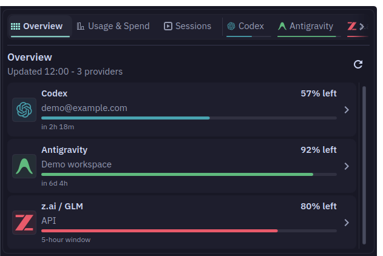

The temporary panel and package were removed after inspection. The original
panel was not rearranged and Plasma was not restarted. Only one monitor is
connected, so movement between monitors with different scales remains untested.
The earlier isolated Qt scaling checks do not substitute for that hardware test.
