# Popup visual review

The review started with the installed widget in the current Plasma theme.
These comparisons render the repository at `07bdf8d` and the proposed changes
in `plasmawindowed`, using identical synthetic provider and cost snapshots.
They contain no live accounts or usage data.

| Before | After | Change |
| --- | --- | --- |
| 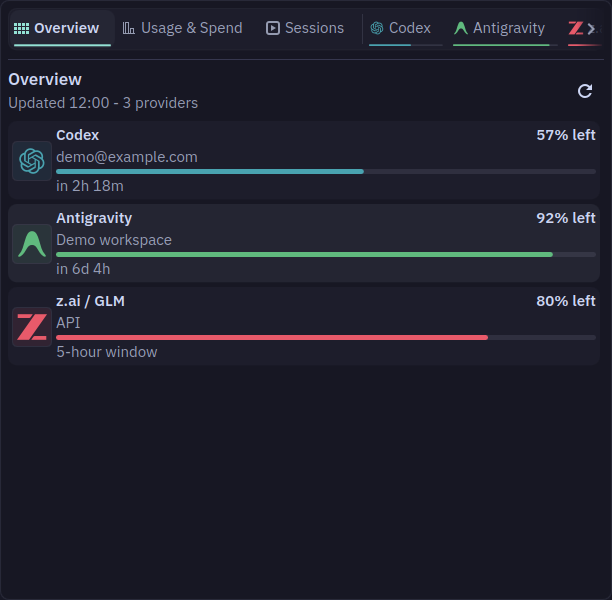 | 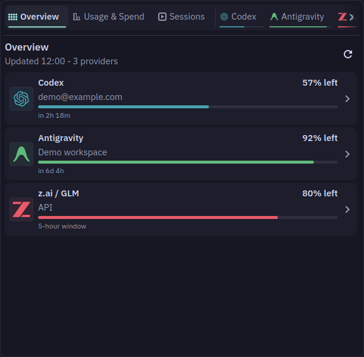 | Rows size to their content, with more padding and a chevron that indicates navigation. |
| 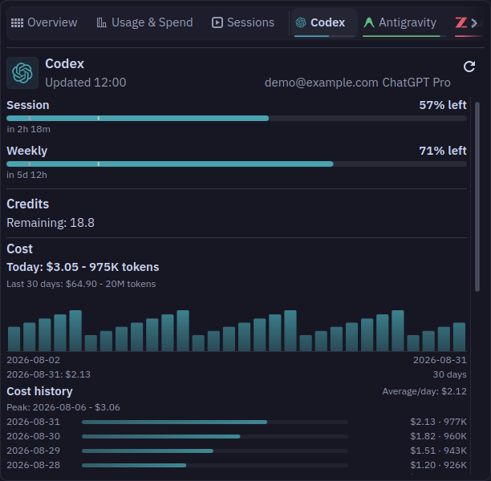 | 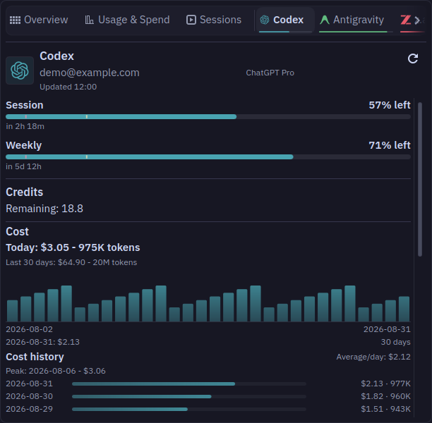 | Account and plan share an identity line; the update time has its own line. |
| 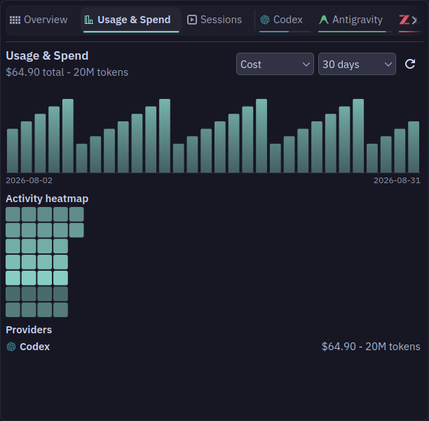 | 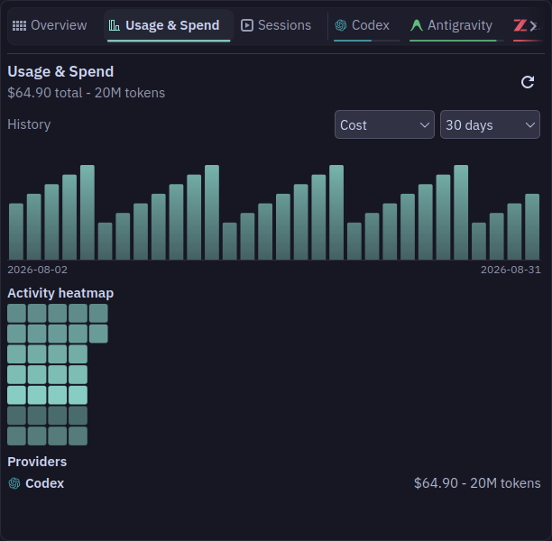 | History filters have their own row, leaving room for the total. |

Every popup refresh action uses the native button's footprint while displaying
a busy indicator. Overview rows show an explicit keyboard focus outline and
clear it when the user switches to the mouse. Direct QtTests cover activation,
busy state sizing, focus changes, and account visibility after reopening.

The design follows the existing Plasma colors, fonts, and spacing units. The
Emil design engineering and Apple design skills informed grouping, hierarchy,
and immediate feedback. No CLI contract or persisted setting changes.

The light-theme check uses Breeze Light, a 14-point body font, and a 12-point
small font in an isolated preview configuration.

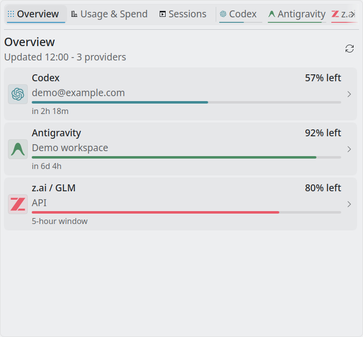

## Settings

The same review covers General, Providers, and Display. These screenshots use
an isolated Plasma configuration and the same synthetic roster of four enabled
and two disabled providers. Provider loading is replaced only in the temporary
preview package. No provider credentials or live account data are included.

| Before | After | Why |
| --- | --- | --- |
| 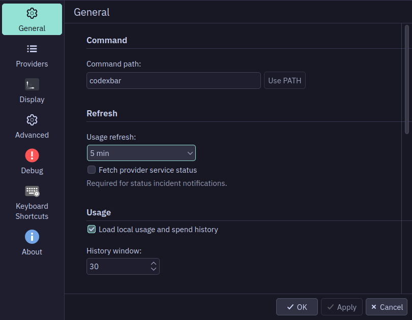 | 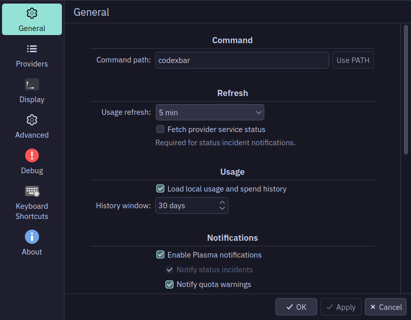 | Bound supporting text lets the native form place labels beside controls when space permits. Notifications and update options indent beneath their parent setting. The history window includes its day unit. |
| 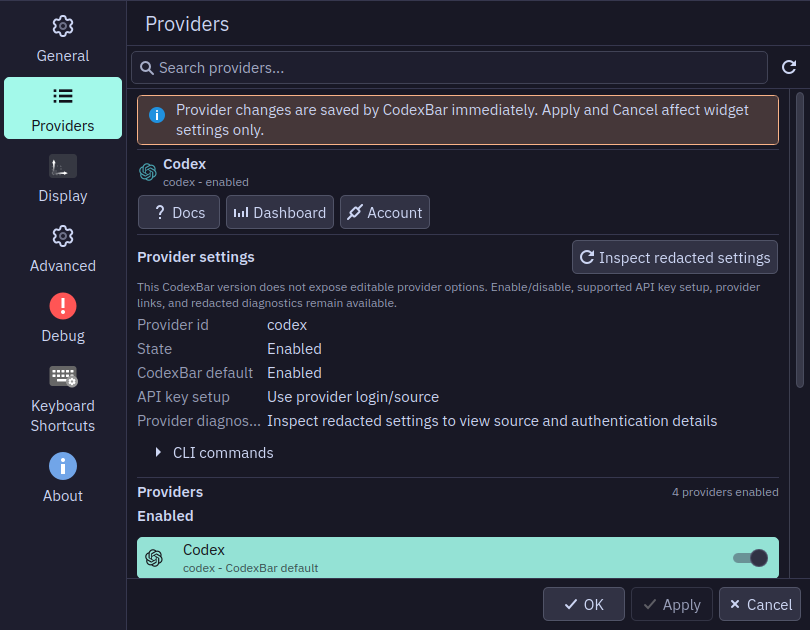 | 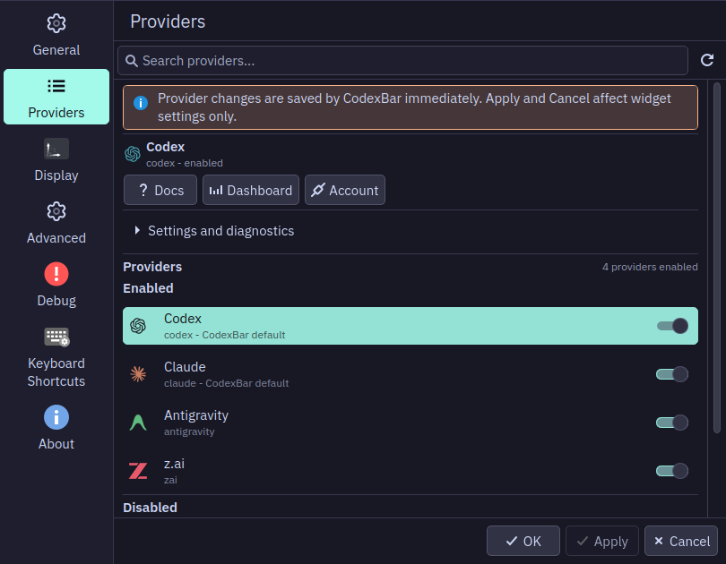 | Settings and diagnostics start collapsed, making all four enabled example providers visible. Provider links and the immediate-save notice remain available. |
| 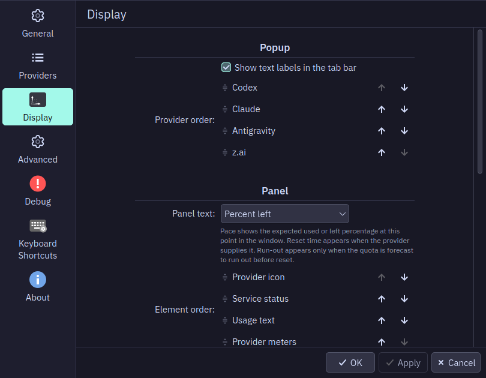 | 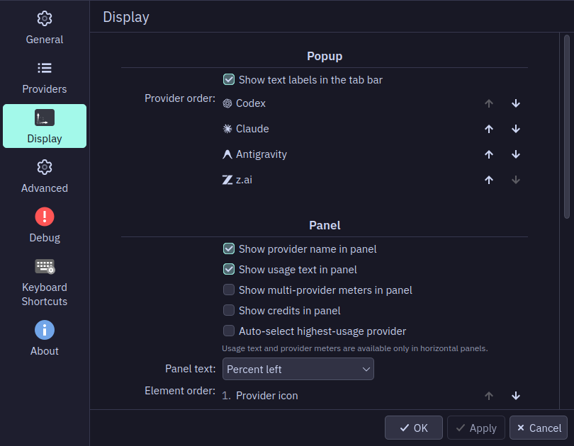 | Provider icons replace inactive drag handles. Panel visibility controls precede ordering, arrow buttons have tooltips, and help describes only the selected text mode. |

The General form was checked at frame widths of 690, 818, and 1100 pixels.
It switches to stacked labels in a narrow window, while supporting text wraps
inside the form. The Defaults explanation no longer extends beyond the page.

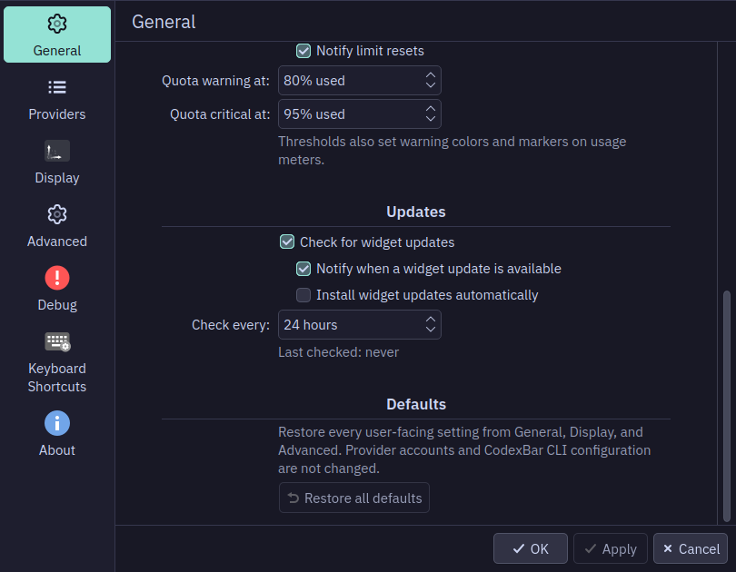

The additional light-theme check uses a 14-point body font and 12-point small
font. The settings disclosure follows the user's body font.

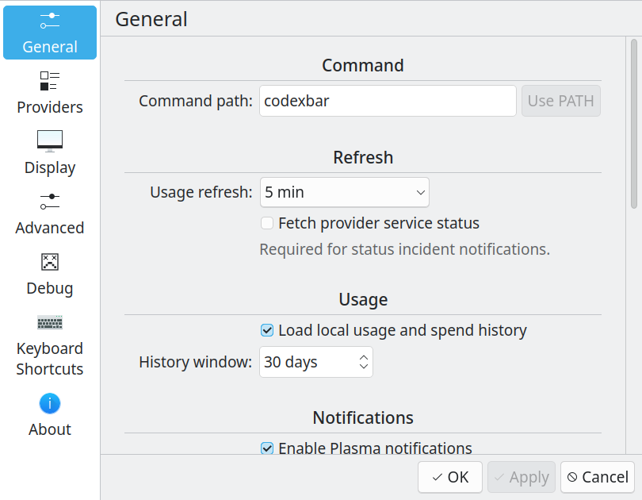

[Providers with larger text in Breeze Light](settings-providers-large-text-light.png)

Provider disclosure and selection, and provider reordering were exercised in
the preview. Opening details does not fetch diagnostics. The disclosure is a
native checkable control and retains the existing CLI-backed options and
redacted diagnostics behind it. No configuration schema or CLI contract changed.
