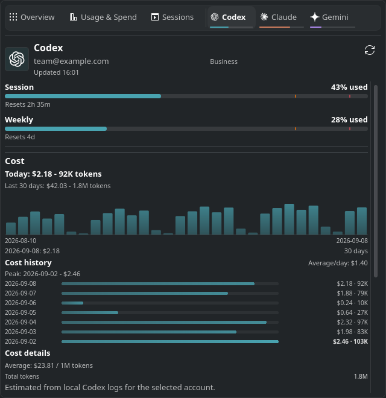
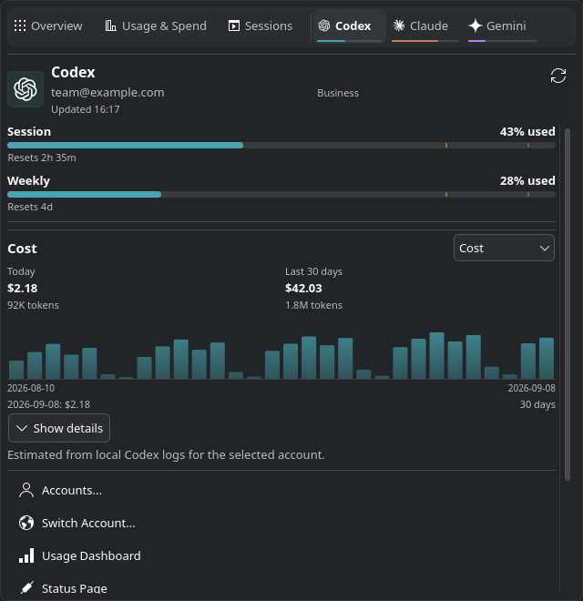
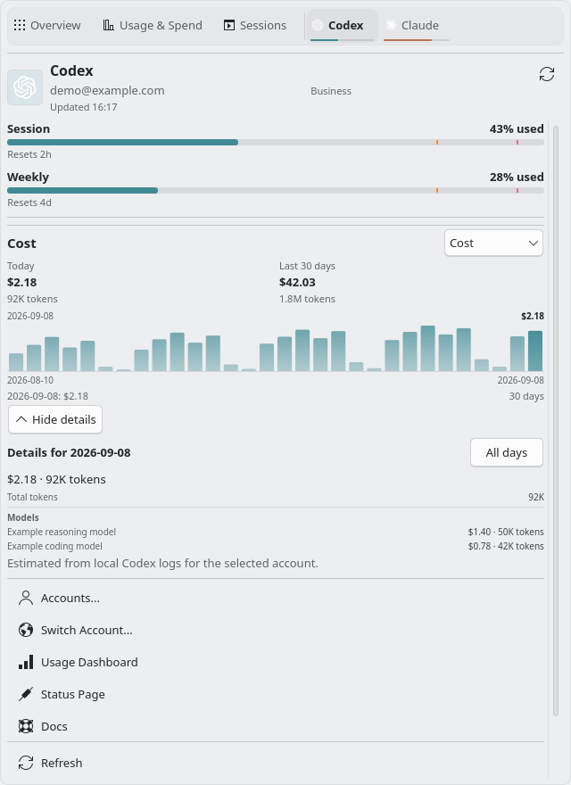
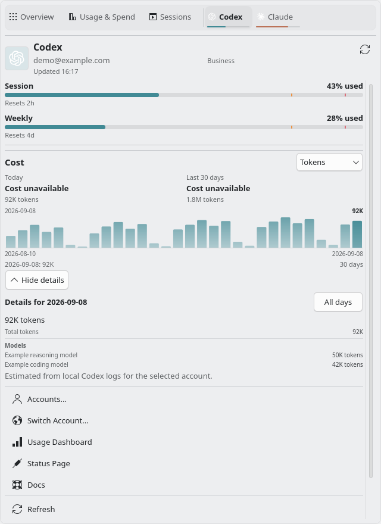

# Popup cost summary and daily models

Scope: the provider popup, inspired by the supplied macOS CodexBar 0.56.8
(139) captures. The before image uses Plasma commit
`8a064eaf92c72cb4a37b4c816e3bc1179bcf3c02`. Every image uses synthetic data.

| Before | After | Why |
| --- | --- | --- |
| Cost summaries stacked above expanded history | Today and the selected period in two columns; details collapsed initially | Keep quotas and provider actions within reach. |
| Models summarized only over the whole period | Click or keyboard selection shows models for that day | Explain a daily spike using the existing cost payload. |
| Initial prototype expanded details on hover | Hover previews stay inside the chart; selection pins the details | Keep layout and reading position steady. |

The `emil-design-eng` review keeps chart navigation immediate, with no new
animation on keyboard actions. Buttons retain Plasma's native feedback.

| Before | After |
| --- | --- |
|  |  |

| Selected day | Token-only data |
| --- | --- |
|  |  |

Cost errors and pricing notices stay outside the collapsible content. Day
models use the same loaded history as the chart, with six displayed rows and
an explicit truncation notice. Missing model data stays empty; absent amounts
stay unknown, while measured zeroes remain visible.

The official CLI reference is v0.56.8, commit
`6ef82690b4a718a21fac42b72a102df07e475509`:
[`CLICostCommand.swift`](https://github.com/steipete/CodexBar/blob/6ef82690b4a718a21fac42b72a102df07e475509/Sources/CodexBarCLI/CLICostCommand.swift).
The popup consumes `daily[].modelBreakdowns[]` fields `modelName`, `cost`,
and `totalTokens`, already used for period model aggregation. It adds no CLI
command or provider-specific data source. Standard/Fast subtotals remain blocked
on an official CLI contract. This scoped comparison does not replace the full
0.56.2 parity audit.

The checksum-verified official Linux x86_64 binary also produced these fields
for two synthetic days and two models: [daily output excerpt](cli-daily-sample.json).
The probe ran `cost --provider codex --days 7 --format json --json-only --refresh
--provider-native-only` with fresh HOME/XDG/CODEX_HOME directories and no network
access, using compact JSONL based on the
[tagged fixture](https://github.com/steipete/CodexBar/blob/v0.56.8/Tests/CodexBarTests/Fixtures/CostUsage/Issue2037/harness-smoke/codex-home/sessions/2026/07/11/parent.jsonl).
It exited 0 with empty stderr. Release archive SHA-256:
`ab98788e12840e5689ae505bf62731e0ea0db1c77e63dceda1589b6e795ac5b8`.

Validation used the repository's pinned KDE neon CI image: strict `make check`
(736 Qt checks and 29 Python tests, no skips), `make package`, and package
install/upgrade. All 36 popup smoke scenarios passed; the three affected
scenarios passed again after the hover refinement. The runtime harness checks
QML errors and isolates the preview from the host desktop and real accounts.

The review follow-up preserves a pinned day across background refreshes and
remaps it by date when chart positions change. A missing or ambiguous date
clears the pin. Provider, account, and history range changes clear both the pin
and expanded details, even when they reuse the same cached cost data. Metric
changes clear the pin while preserving explicitly expanded period details.
The chart's index clamp cannot replace the saved day during reconciliation.

Follow-up validation: strict `make check` passed with 752 Qt checks and 29
Python tests, no skips. Packaging and isolated package install/upgrade passed.
Both `popup-cost-details` and `popup-cost-tokens` smoke scenarios passed with
new refresh, reordering, removed-day, cached-account, and range regressions.
The identical-refresh regression failed on the previous implementation.

The [imported agent review follow-up](agent-review-follow-up.md) records the
token-availability, period-model coverage, and account-identity fixes.
