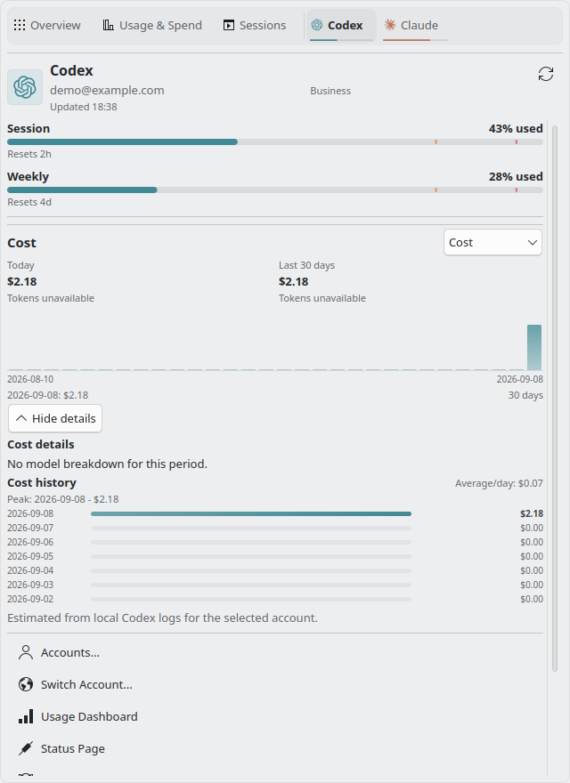
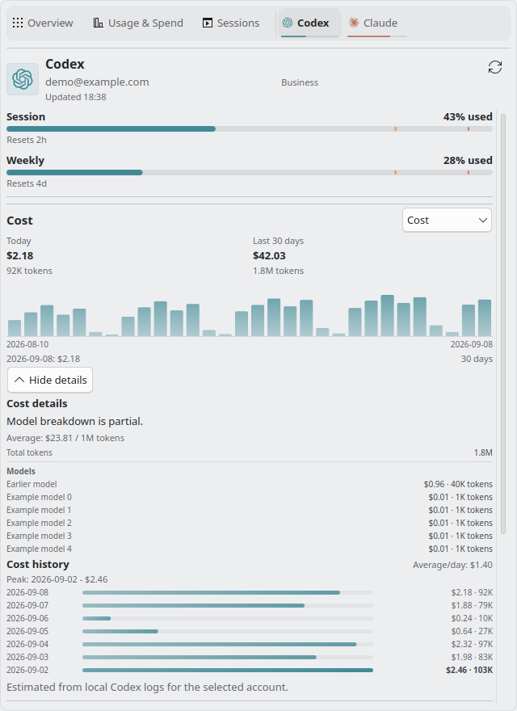

# Imported agent review follow-up

Reviewed the [GLM review](https://github.com/Lucenx9/codexbar-plasma/pull/160#issuecomment-5589817274)
and [Muse review](https://github.com/Lucenx9/codexbar-plasma/pull/160#issuecomment-5589917391)
against `a9423863de85c48c18923f8709865d199188f41e`. The Gemini review and the
subsequent Codex review reported no required changes.

| Before | After | Why |
| --- | --- | --- |
| Missing period token counts became zero | Summary tiles and aggregate spend preserve unavailable counts | Absence is different from a measured zero. |
| Calendar gaps always acquired zero tokens | Only metrics observed in the snapshot receive zero-filled gaps | Cost-only history must not produce a token chart. |
| Period models disappeared when absent, and capped lists hid their limit | Period and day details share empty and partial notices | A six-row list must not imply a complete breakdown. |
| Organization-only account changes could retain a pinned day | Selection uses the same account label as the account picker | Legacy account identity must also reset the details. |

Today amounts now use the existing pure normalizer. Negative-only token parts
remain unknown; explicit zero parts remain zero. Overflow never becomes a zero
total. Model ranking uses a label tiebreaker when both amounts match, so payload
order cannot shuffle tied rows.

The refresh smoke fixture asserts that its incremented token count is a finite
number. Separate missing-token fixtures exercise null counts without coercion.
The range regression now changes the actual persisted preference, retains the
old snapshot, and checks that the incompatible cached range stays hidden and
clears the pin.

The remaining suggestions were checked as follows:

| Suggestion | Decision and evidence |
| --- | --- |
| Accept numeric model names | Keep the string-only display contract. The CLI sample uses textual `modelName`; numeric coercion was incidental legacy behavior. A regression rejects numeric `123` while retaining the string `"123"`. |
| Replace JSON scope serialization because null, undefined, and NaN collide | Those are not distinct normalized scopes. Account labels are strings and history days are bounded positive integers before the popup receives them. The actual organization-label gap is fixed through the existing canonical account-label helper. |
| Preserve a pin with duplicate or empty dates using `sourceIndex` | Keep clearing ambiguous pins. An index identifies a row only within one snapshot and changes when days are removed or reordered. |
| Keep the period efficiency rate while inspecting a day | Keep the rate in the period view, available through **All days**. Showing a period rate inside a dated detail would mix scopes. |
| Hide a single measurable chart day | Keep it selectable to expose that day's models. The label states the date and value; no trend is inferred. The chart domain includes zero, so a positive singleton does not have equal minimum and maximum. |
| Add null guards to callbacks invoked by the chart itself | No failing lifecycle found. These handlers run on signals from the live chart; the parent scope-change handler already guards pre-construction access. The popup smoke runs report no lifecycle errors. |
| Extract the two label/value delegates, replace identity strings, or simplify the hint ternary | Leave these cosmetic choices unchanged. They do not explain an observed defect, and the delegates already follow the required model-data and text rules. |

The original prototype guards, bounded loops, translations, and smoke tooling
remain in place. No provider scraping, authentication, or new CLI contract was
added.

| Missing tokens and period models | Partial period models |
| --- | --- |
|  |  |

Strict `make check` passed in the pinned KDE neon container: 767 Qt checks and
29 Python tests, no skips, including native QML lint and AppStream validation.
Packaging and isolated package install/upgrade passed.

The complete smoke run passed 36 of 38 scenarios. The other two exposed a test
assumption: changing the requested range deliberately fetches that range, unlike
day or metric selection. After fixing the assertion, both scenarios passed.
The two new availability/coverage scenarios also passed again with the final
period screenshots above. All 38 scenarios are covered; final affected runs
contain no detected QML errors. The catalog template was regenerated after its
initial reference-only mismatch. The new data regressions failed against the
previous implementation before the fixes.
