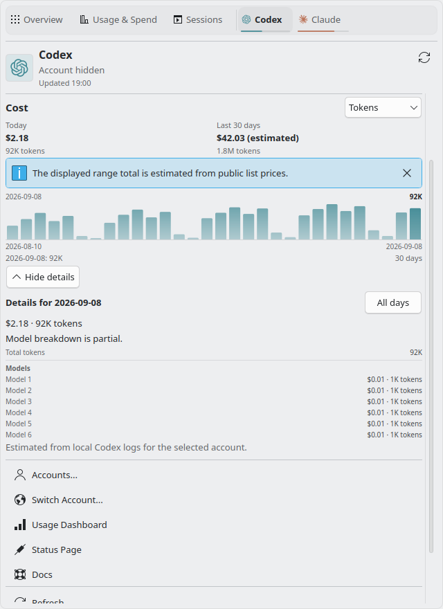

# PR 162 review follow-up

Reviewed the Codex and CodeRabbit threads, the Gemini and GLM reviews, and the
Muse review posted in the PR conversation. Copilot did not complete a review
because its quota was exhausted.

Rebased the settings branch onto `4ff018e`, the merged popup PR #160. Kept the
compact cost summary, daily model inspection, unknown amounts, and all existing
popup regression scenarios.

| Before | After | Why |
| --- | --- | --- |
| Privacy discarded Cursor's numeric included-plan percentage. | Retain only the bounded percentage for metric selection; keep free-form billing content hidden. | Privacy must not change the quota shown by panel text, meters, or popup tabs. |
| The preview printed an exhaustion duration without an active forecast and could pass fractional counts to plural labels. | Require a forecast and format whole minutes, hours, and days consistently with the panel. | The preview should match the configured panel. |
| Preview threshold fallbacks repeated literal percentages. | Use the defaults and normalization in `QuotaThresholds.js`. | Keep one source for warning thresholds. |
| The settings branch projected the older cost layout. | Project daily models, independent period/day truncation, unknown token components, period labels and estimate qualifiers for #160's cost component. Keep the raw account selection key separate. | Private costs remain useful, and changing accounts still clears the pinned day. |
| The background pointer test split at the first `MouseArea` brace. | Locate `compactBackgroundMouse` through the existing balanced id parser. | Nested handlers or reordered controls cannot silently change what the assertion checks. |

The action menu still reads raw provider capabilities and account presence, with
local action titles. It never renders identity values or provider prose. The
contract now has a comment next to `actionRows`; projecting away URLs would
remove valid actions. The clock rollback policy also has an explicit comment:
refresh once rather than wait for the old wall-clock timestamp to catch up.

## Findings not reproduced

Codex's cross-page pending-value reports and CodeRabbit's stale notification
mirror report assume that Plasma keeps several settings pages alive with a
shared pending transaction. The supported container ships a different lifecycle.
Its `plasma-workspace` package is
`4:6.7.4-0zneon+24.04+noble+release+build94`, with the dialog implementation at
`/usr/share/plasma/shells/org.kde.plasma.desktop/contents/configuration/AppletConfiguration.qml`.

- `pushReplace` replaces the current page.
- `open` reads `Plasmoid.configuration` and supplies current `cfg_*` values when
  creating the next page.
- A page switch with unsaved changes opens Apply/Discard/Cancel. Apply saves
  the current page before opening the next one; Discard opens it without saving;
  Cancel leaves the current page in place.

The Panel preview and Notifications page therefore read the applied values from
other pages. General receives a fresh `cfg_enableNotifications` when reopened.
Keeping that pending property also lets General's global defaults action update
the dependent control before Apply. Changing it to a live-only read would lose
that behavior. No extra `cfg_*` owners were added.

The suggested shared refresh policy, preview-wide formatter extraction, nonce
constant extraction, helper renaming, and guards for currently absent callers
remain outside this fix. All current privacy callers supply labels and numeric
Repeater indexes. The review's clipboard-clearing description refers to the
widget's copy buffer; privacy does not erase the OS clipboard.

CodeRabbit's Biome errors concern QML `.pragma`/`.import` syntax. The repository's
native `qmllint` and Qt tests validate those modules. Its generic docstring quota
does not match the repository's rule to comment non-obvious behavior.

## Verification

`make check` passed in the disposable KDE neon container with strict imports
and `QML_TEST_REQUIRE_NO_SKIPS=1`: 811 Qt tests plus 3 desktop-style results,
34 Python tests, ShellCheck, QML lint, catalog checks and AppStream validation.
No failures or skips. The first run caught an obsolete assertion expecting
`providerCost: null`; its replacement checks the preserved percentage and
redacted prose.

All 45 OpenGL smoke scenarios passed. The private-cost scenario was then rerun
after making its final screenshot selection idempotent. `make package` and
fresh installation/upgrade with `kpackagetool6` passed in an isolated data
directory. No host `plasmashell` restart was performed; runtime checks used
`plasmawindowed` with synthetic data and separate configuration.

Focused regression coverage includes invalid Cursor percentages, independent model truncation,
unchanged source records, absent token components, forecast gating, and rounded
durations. The `privacy-cost-details` smoke scenario exercises the real popup,
including anonymous period/day models, estimate labels, metric changes,
account/organization changes, and redacted cost errors.

