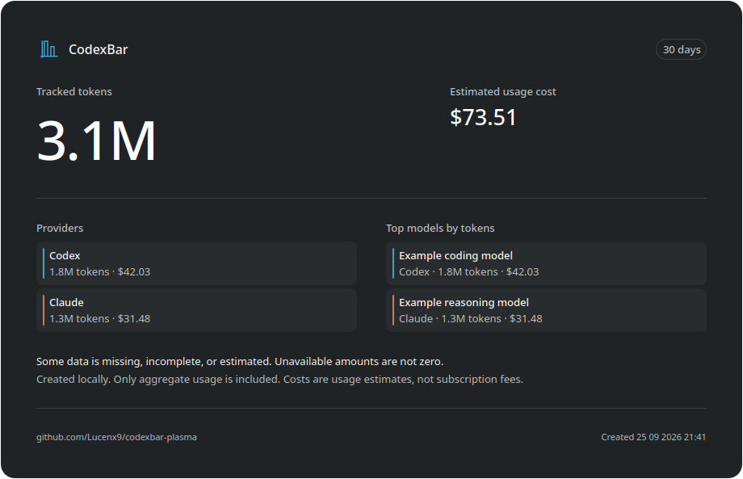

# Using CodexBar Plasma

See the [README](../README.md#install) for installation and first setup. This
guide covers display options, provider setup, history, notifications, and
defaults. Available data and actions depend on the selected official CLI.
The [documentation index](README.md) links the full CLI 0.56.2 audit and later
scoped evidence. [TODO.md](../TODO.md) tracks remaining Linux/Plasma parity
work and upstream contract requirements.

## Panel and popup

- Standard shows a small colored provider icon beside quota capsules. Minimal
  uses the same geometry with monochrome icons and capsules in the Plasma text
  color. Warning and critical colors remain independent for each quota.
  When a provider's brand hue is within 20 degrees of the theme's warning or
  critical color, its capsules use a muted version of the brand color, so a
  healthy quota cannot pass for an alert; the provider icon keeps the brand
  color. The muted color keeps the capsule's contrast with the panel and is
  used only when it looks less like the warning colors than the brand does,
  so a yellow brand beside a pale cream warning keeps its color. Any quota above zero keeps at least a round dot of fill, so an almost
  exhausted quota stays distinct from an empty one.
- Automatic panel meters show the primary quota above the secondary quota when
  both have percentages. A single available quota is centered vertically;
  absent quotas are omitted, while measured zero remains an empty track. If
  neither primary nor secondary has a percentage, the existing automatic
  preference supplies one available fallback quota.
- Provider meters work in horizontal and vertical panels. Names, usage text,
  and credit text remain horizontal-only. Click a provider's icon, capsules, or grouped text,
  or activate it with the keyboard, to open its detail tab. Hovering one
  provider's icon narrows the panel tooltip to that provider alone; hovering
  elsewhere shows the whole roster. Accessible descriptions identify the
  displayed quotas and their values. The standalone provider icon opens that
  provider's detail tab too, including when meters are hidden. With no panel
  provider selected, the widget icon toggles the popup without changing its tab.
- With the default element order, optional text sits after the selected
  provider's capsules in one group, with a single logo. The other providers keep
  their own icon and capsules. If that provider's meters are hidden or unavailable,
  its text keeps a separate identity. Custom element orders retain separate
  text and meter positions. Separate text keeps its identifying icon among
  multiple meters; a single selected provider meter does not repeat the icon.
- Panel width is bounded, so a crowded meter row can leave the optional text
  less room than every enabled item needs. Whole items are dropped rather than
  cut short, in a fixed order: the provider name first, because the icon beside
  it already identifies the provider, then the credit balance, keeping the usage
  text last. For a provider the widget has no icon for, the panel draws a
  generic icon shared with every other such provider, so there the name is the
  only identification and outlives the credit balance instead.
- Nothing that is dropped becomes unreachable. Accessible names keep the whole
  text, the panel tooltip reports each provider's quotas, incidents, and its
  credit balance while panel credits are enabled, and the popup keeps every
  detail. A single remaining item is elided only as a last resort.

  

- **Use monochrome icons and meters only** in **Additional information** selects
  Minimal and enables provider meters, including with a single
  provider, and hides panel names, usage text and credits. The style selector
  changes appearance alone. Existing installations keep their style, explicit
  quota choice, and visibility settings. Automatic meters gain the second quota
  without a new setting or additional CLI calls.
- Provider tabs with usage bars, reset windows, account identity, status, and
  credits. The tab surface marks the selected view; a provider tab's underline
  is its automatic quota meter, never a selection mark.
- A plain credit balance has no allowance denominator and stays meter-free.
  A monthly Codex credit meter appears only when the CLI provides the validated
  `credits.codexCreditLimit` record. Its limit never applies to a plain balance.
- Panel text modes for percent used or left, pace, usage plus pace, reset time,
  and a run-out forecast that shows the predicted duration only while the CLI
  expects the quota to run out before its reset.
- Choose the automatic, primary, secondary, or tertiary quota for panel text and
  meters in **Panel → Quota, order and visibility**. An explicit primary, secondary, or tertiary
  choice shows one capsule. Automatic text and popup tabs retain their existing
  quota preference; automatic capsules use the pair described above.
- Set independent visibility conditions for the full panel text and each
  provider meter: always, minimum percent used, reset within a chosen number of
  minutes, or forecast exhaustion before reset. A provider meter stays visible
  when either displayed quota meets its
  condition; both capsules remain together. Text uses its own displayed quota.
  Conditions respect existing visibility checkboxes and need no extra CLI calls.
  Missing data does not satisfy a condition. Reset conditions update each minute;
  the provider icon remains available when all conditional elements are hidden.
- Auto-select highest-usage provider for the compact panel and provider detail
  focus. Consumption takes precedence even for fractional percentage differences;
  incident severity breaks equal-consumption ties, then saved provider order.
- Panel providers can be limited to a chosen set in **Panel → Panel
  providers**. The choice lists the enabled providers in their saved order, is
  limited to the four meters the panel can draw, and can also be left automatic
  (every enabled provider). The panel meters, panel text, identity, and panel
  tooltip follow the choice; a popup selection outside the chosen set falls
  back to the first chosen provider, or the highest-usage chosen provider with
  auto-select. The popup keeps listing every enabled provider, and quota
  fetching and notifications stay unchanged.
  Clearing every checkbox hides provider text and meters while keeping the
  widget icon available to open the full popup. This explicit empty selection
  is saved as `__none__`; use **Use all enabled providers automatically** to
  restore automatic selection. Disabled providers retain their saved selection
  but do not occupy one of the four available slots. If more than four selected
  providers become enabled again, the first four in provider order appear.
- Overview tab with per-provider usage summary and quick switching. Each row's
  detail line shows the account identity when the CLI provides one, and an
  active service incident otherwise; an operational status or the provider's
  own source name is never presented as identity.
- Overflowing popup tabs have separate scroll buttons and immediate keyboard
  focus reveal, so navigation never covers provider labels. A tab wider than the
  available area stays aligned at its start when focused or selected again.
- Global **Usage & Spend** tab with a Cost/Tokens selector, a 7/30/90-day range
  selector, interactive daily chart, activity heatmap, and provider totals that
  keep different currencies separate. The heatmap groups the range into weekday
  rows, labelled with the system locale's short day names, and week columns
  whose cells widen up to a 2:1 tile, leaving empty cells for unavailable days in the loaded
  calendar, including its first and last days. Measured zero remains a recorded
  day. It stays hidden for ranges that fill a single column.
- Local **Sessions** tab backed by `sessions --json-v2`; transcript paths and
  working directories are never rendered or opened. The tab refreshes stale
  session data while it remains visible. Failed scans also respect the refresh
  interval from the failure or timeout (five minutes when periodic usage
  refresh is disabled), so reopening
  the popup or revisiting the tab does not repeat a failed scan immediately.
  The Sessions refresh button can retry immediately; changing the CLI command
  clears the retry cooldown.
- Overview providers can be limited to a chosen set of up to 3 providers, or
  left automatic (the first 3 eligible providers). The checkboxes recognize
  provider aliases and mixed-case IDs, like the panel provider selection.
  Disabled providers keep their saved selection without occupying one of the
  three slots. If more than three selected providers become available again,
  Overview shows the first three eligible providers in the saved provider order.
  Provider selection checkboxes preserve literal characters such as `&`, `<`,
  and `>` in display names, including with KDE desktop styles.
- Usage dashboard summaries for provider payloads that expose API spend,
  request, token, model, or dashboard fields through the CLI.
- Declarative provider detail sections from the CLI `usage.details` contract,
  including labeled rows, secondary values, and keyboard/pointer-inspectable
  bar/line charts. A row that carries a valid `progress` used/total pair, such
  as a Bifrost budget, also draws a thin meter under its text; the meter fills
  at most to the total, and rows without a valid pair keep their text alone.

## Data freshness

When no provider data is available, the popup offers **Configure providers**
with a hint to open **Providers** in widget settings. A confirmed empty list of
enabled providers uses this setup state and still clears previous quotas and
their cache. Global and provider usage errors offer **Retry** and **Settings**,
with a hint to open **Diagnostics** for
connection checks.

A command Plasma cannot run at all takes a separate state. When the shell
reports that the configured command was not found or is not executable, the
empty popup says **CodexBar CLI not found**, names the configured value, and
sends you to **Diagnostics** to set an absolute path. It offers no **Retry**,
because repeating a command that cannot start cannot succeed, and it does not
claim that no provider is set up. Any other failure keeps the existing error
and setup states. Retained providers, a refresh in flight, and the global
views keep precedence over this state. Both settings actions open Plasma's standard widget settings
window; select the named page there. They do not change configuration or run
diagnostics automatically.

**Retry** starts the existing manual quota refresh, including a fresh provider
list, and is disabled while a usage refresh is running. It does not scan local
cost history or sessions. The existing last-known quota and timestamp rules
below also apply while retrying and after another failure.

Malformed optional login-method metadata does not discard valid provider quotas
or named accounts. The Codex plan label uses the same validated login method as
the account details, including a valid fallback supplied by the CLI.

Failed usage refreshes keep the last valid quotas visible. Each retained provider
shows **Last known usage** with the age of its measurement in the popup and panel
tooltip; its panel icon and capsules are dimmed. Errors remain visible. A provider
error with an empty or malformed message shows a generic error and follows the
same quota-retention rules. A partial
refresh updates healthy providers independently, and a successful refresh removes
the retained-data indication. When a provider-scoped reply contains multiple
records, an unreadable record does not prevent a later healthy record from
updating that provider; a reply with no readable records remains an error.
Retained data never generates quota, pace, reset,
or status notifications, and its run-out forecasts are suppressed. If a failed
quota response includes newly fetched service status, that status still updates
and can trigger incident notifications independently of the retained quotas.
Stale quotas preserve the previous quota, pace, and reset notification state,
even when the CLI reports success with old quotas and current status. If no fresh
quota has been seen, the first fresh measurement establishes that state silently.
Panel run-out countdowns advance from the receipt time of their own forecast.
Selecting a cached account preserves that time, including in privacy mode;
a later refresh for another account cannot restart its countdown.
Failed refreshes stop reusing measurements older than 24 hours, and a quota
measurement older than 24 hours never stamps a new snapshot as fresh. A failed refresh that
reports a different account than the retained measurement does not reuse it; a
failure that reports no account still does. Restored cache entries hold no
account, so an early failed refresh keeps them only for a provider whose
explicit account selection the cache fingerprint already covers. The existing minute
timer also removes expired retained data when automatic refresh is disabled;
the error remains visible and healthy providers are unaffected. Successful
responses without measured quotas keep their valid credits or details even when
their supplemental timestamp is old; they do not enter quota retention or expiry.

The widget automatically saves a small quota cache in its Plasma configuration.
After a restart it verifies the CLI configuration fingerprint before restoring
the cache, then refreshes in the background. Malformed checksum replies leave
the current fingerprint and quotas intact. Restored quotas are always marked
last known, even if they were saved recently. A cache is not a successful refresh.
If a partial refresh finishes before that verification, its results take
precedence for the providers it returned. Other cached providers are restored
as last known and included when the merged snapshot is saved.

The disk cache is limited to 64 KiB of UTF-8 on both save and restore. It holds
at most 64 providers and only their primary, secondary,
tertiary, and up to 24 extra quota windows per provider, with only percentages,
reset timestamps, measurement timestamps, and an opaque
configuration fingerprint. It contains no account identities, credentials,
provider prose, cost history, session data, or paths. Entries older than 24 hours,
future-dated entries, corrupt records, and unsupported cache versions are ignored.
Supplemental sections (cost, credits, detail views, token costs) are hidden
while usage is stale, including after cost refreshes and history-range changes,
and are not restored from disk; only the retained quotas carry the last-known
indication. A missing, invalid, or future live measurement timestamp uses its
original receipt time. Selecting a cached account preserves that fallback and
its 24-hour retention deadline, even if the CLI timestamp has since become past;
future timestamps in persisted records are rejected. The 24-hour limit is a widget policy, not a guarantee
that a retained quota remains accurate throughout that period.

Changing the CLI path, provider/source override, provider configuration, or selected
account invalidates the affected retained data. A per-provider reset keeps
healthy providers' disk cache; a full reset clears it. Disabling all
providers clears the cached quotas. A confirmed successful response without a
quota removes its previous value; measured zero remains zero. Privacy mode hides
identities as usual and keeps the last-known indication visible.

## Providers and accounts

Provider-specific editable settings depend on the official CLI contract.

- Search providers by name or ID and filter All, Enabled, or Disabled locally.
  Clear filters restores the list without changing selection or provider settings.
- Provider enable/disable and setup actions write CodexBar configuration
  immediately; Apply and Cancel cover widget settings only.
  A CLI error with an empty or malformed message shows a generic failure
  instead of confirming that the change was saved.
- API key and secret prompts stay open while you type. A prompt left open for
  about 15 minutes closes by itself, the provider's actions unlock again, and
  the prompt can be reopened. Submitting near that limit still allows the full
  one-minute save timeout, followed by up to five seconds to stop the command.
- Account discovery and selection through `codexbar usage --all-accounts`.
- Provider docs, dashboards, login/account links, and redacted diagnostics.
  The selected provider's links, settings and diagnostics share one surface
  above the provider list; **Settings and diagnostics** starts collapsed.
- With the official CLI 0.56.2 verified by this repository, the Providers page
  offers enable/disable, supported single API key setup, CLI command hints, and
  docs/dashboard/login links.
- The widget also has a renderer for the proposed
  [provider settings descriptor](cli-provider-settings-descriptor.md).
  CLI 0.56.2 does not expose that contract, so source, cookie, base URL,
  workspace/project, region, and other descriptor-backed editors remain
  unavailable. They require upstream CLI support.
- Generic API key setup for Fireworks, when the selected CLI reports version
  0.54.0 or later and can discover the account slug from the key.
- Fallback names, icons, and documentation links for all 80 providers in the
  official CodexBar 0.65.0 registry, plus colors, links, and aliases where
  upstream defines them; fork-only provider assets, and those for providers a
  later CLI retired, remain available for compatibility.

## Costs and history

### Share usage

Choose **Share AI usage** in the Usage & Spend header to open a separate window.
It uses the selected history range and freezes the currently loaded data until
reopened. It does not start another CLI scan. Refresh history first for a newer
snapshot; the creation timestamp is not a measurement timestamp.

**Copy image** places image data on the clipboard, **Copy statistics** copies the
same aggregate figures as plain text, and **Save PNG...** opens the platform save
picker with overwrite confirmation. Saving supports local PNG files. The image
uses the Plasma colors and fonts and includes a small
`github.com/Lucenx9/codexbar-plasma` attribution in its footer.

Totals include the loaded providers; at most eight provider rows and six models
are shown, ranked by tokens, with omitted row counts. Model rows without a token
count are excluded from the ranking. Currencies remain separate. Unknown values
are not zero, and incomplete or estimated data retains a notice in both exports.
The ordinary six-row display limit alone does not trigger that notice.
Missing costs on a model's measured token days and source scans that reach their
safety bound still trigger it, including in privacy mode.
Costs estimate usage, not subscription fees; subscription plans are not exported.

Only aggregate fields enter the export. Account identities, projects, absolute
paths embedded in model labels, raw diagnostics, and conversation content are
excluded. Privacy mode keeps its model anonymization and masks unknown provider
identifiers in both exports; changing that setting closes an open snapshot.
Nothing is uploaded. Copying or saving is an explicit action. The exported file
and clipboard content remain under your control after closing the window.

### History details

- Local cost drill-down when the CLI exposes cost data.
- In the verified CLI 0.56.2 contract, Antigravity supplies token-only local
  history; its dollar amounts remain unavailable. Official CLI 0.62.0 adds the
  same token-only history for Muse Code, read from local Muse session logs
  with unavailable monetary fields absent. Cursor local or dashboard
  cost is rejected by the Linux CLI. Other provider fields, including Kiro
  overage, z.ai BigModel CN balance, and Cursor Grok Bot usage, use the existing
  generic detail, provider-cost, and extra-window paths.
- A compact provider summary compares today with the selected period. Expand
  details for period models, history, and projects; cost warnings remain visible,
  including when a failed refresh keeps the previous cost snapshot. A successful
  refresh clears the error. Malformed provider error messages use a generic
  warning while healthy providers update and failed providers keep their
  previous costs.
- Click a day in the provider chart or select it with the keyboard to see that
  day's model costs and tokens. Hover previews stay inside the chart, keeping
  the layout steady. The cost/token selector reuses the loaded data.
  Missing model breakdowns and truncated lists are identified explicitly.
- Local-history scans run independently from quota refreshes, automatically at
  most once per hour; the **Usage & Spend** refresh button starts one immediately.
  Revisiting **Usage & Spend** refreshes history that became stale since the last
  scan, and a spend view left open across midnight refreshes once for the new day.
  Switching the Cost/Tokens metric or inspecting a day reuses the loaded data and
  starts no scan. Cost settings applied together start a single scan using the
  final executable, provider, and history range; disabling costs starts none.
- Token breakdowns, model summaries, recent daily spend, cost history bars, and
  average cost per 1M tokens, with a configurable cost history window. Recent
  history rows show measured zero costs and token counts alongside positive
  amounts; missing amounts stay omitted. The daily average stays visible for a
  range measured as zero, and the peak still names a day only once something
  was spent.
- **Quota weeks** in the expanded provider details split the local history by
  the provider's weekly quota window: the current week so far and up to three
  earlier ones. Each row shows its start and end; the current row ends at the
  upcoming reset. Right after a reset, the current week holds no full day yet
  and is left out until it does. The boundaries come from the weekly usage
  row's reset time and window length, so the list appears once a live usage
  refresh reports them. History is kept per day, so when the reset
  falls inside a day that whole day counts toward one week, and the totals are
  marked `≈`. Unknown or missing days, and days with requests excluded from
  the CLI totals, make a total read "at least". Weeks reaching back before
  the scanned history range are left out rather than shown incomplete. If the
  last successful cost scan is older than today, unscanned trailing days also
  make the affected week read "at least". When the CLI reports that history
  coverage is still being established, every displayed week reads "at least"
  even if its recorded days have numeric amounts.
- Token, request, and point counts use the current language's singular and
  plural forms. Large counts retain compact notation such as `1K` and `4.3B`.
- Cost totals qualified as estimated, partial, or approximate from the CLI's
  bounded pricing coverage and provenance metadata.
- Project cost and token totals in **Usage & Spend**, ranked within each provider
  by the selected metric and using the same history range. The official CLI
  0.56.2 exposes project data for Codex. Missing amounts remain unavailable;
  project paths and nested source records are discarded. The bounded list
  signals omitted projects and does not change provider or global totals.
- Cost-trust notices explain why a range is incomplete or estimated, including
  how many requests the CLI excluded from the displayed totals because they
  lacked final usage. Closing a
  notice suppresses the same meaning for that provider or the aggregate Spend
  view across refreshes and popup reopenings; a materially different warning is
  shown again. A changed count of excluded requests describes the same warning
  and stays closed.

See [Cost history](cost-history.md) for data bounds, selection rules, and
evidence. Dashboard extras and additional history views require official CLI
fields; track proposed extensions in the issue tracker.

## Status and notifications

- Provider status incident badge in the panel and provider detail view. The
  detail view states a current incident once, in the banner below the header,
  which always names the severity even without a CLI description; the header
  badge is only a fallback for an incident with no banner text. The
  panel badge sits on the incident provider's own meter icon, follows provider
  reordering, and stays visible while a refresh runs. The standalone
  service-status panel element remains a fallback when no meter can carry the
  badge, such as hidden meters or an incident provider without meters. When
  meters are hidden in a vertical panel, the identity icon carries a badge only
  for its own provider's incident; an incident on another provider keeps the
  standalone fallback. Incident selection, badges, banners, and tooltips ignore
  a provider whose current status is unknown or has no active incident. When a
  refresh omits status, a previously retained outage is hidden; this is not
  evidence of recovery. Current status can still report an incident when quota
  fetching fails.
- Optional quota warning markers on usage bars.
- Optional Plasma notifications for provider status incidents, configurable
  quota crossings, predicted quota exhaustion from CLI pace data, and when a
  heavily used limit resets back to empty. Notification text is shown
  literally: markup in provider or status text never becomes a link, emphasis,
  or an image.
- Clicking the available-update notification opens that release's page on
  GitHub, addressed from the tag the updater announced. The notification stays
  non-clickable when the release address is unknown or the installed
  `notify-send` predates notification actions.

## Settings

- Seven settings pages: **General**, **Providers**, **Panel**, **Popup**,
  **Notifications**, **AI Insights (Beta)**, and **Diagnostics**. CLI path and provider/source overrides
  sit beside redacted diagnostics; quota thresholds sit beside their alerts.
  **Popup** groups provider order and Overview providers under **Providers**;
  **Diagnostics** runs redacted diagnostics from its **Provider diagnostics**
  section. Explanatory text is set in small secondary type below the control
  it describes, and dependent options are indented under the option they need.
  **Diagnostics** also reports the widget version, and, after **Check
  versions**, the CLI version and the absolute command the shell resolved.
  Those three lines are what a bug report needs; the probe runs only when
  asked, and a changed command path clears the previous result.
  **Popup** and **Notifications** keep their text and controls still while the
  page opens, including while the Popup provider list arrives.
- **Panel** starts with the preview, side-by-side Standard/Minimal choices, and
  provider meters. Text and controls keep their horizontal position as the page
  opens. **Additional information** contains the selected provider's
  name, usage text, credit balance, and the monochrome preset. Its closed summary
  lists enabled information. Text format appears only when usage text is enabled;
  hiding controls preserves their selected values. These additions work in
  horizontal panels; meters also work in vertical panels. With several panel
  providers the panel may not have room for all of them and drops the least
  important first, as described above.
- **Quota, order and visibility** expands the quota selector, element order,
  visibility conditions, and automatic provider selection. It starts collapsed
  whenever the page opens. Its summary lists non-default quota/order choices,
  configured conditions, and automatic selection even while collapsed. Opening
  or closing it never changes saved or pending preferences.
- A live **Panel** preview uses example data and the actual panel renderer.
  Try normal usage, near-limit usage, a service incident, or missing data before
  applying changes. It stays above the scrolling options, including quota,
  order, and visibility controls. The preview never fetches usage or changes
  saved settings. After **Panel providers** loads, the preview uses the enabled
  provider names with synthetic measurements. Before that list is available,
  it uses the fixed Codex and Claude examples.
- Optional **General → Hide personal information** hides account, organization, project,
  model and session names in the widget, its tooltips and new notifications.
  Free-form provider details are omitted; session copy actions are disabled.
  Stored data, existing clipboard contents and already-delivered notifications
  are unchanged. Provider setup and Diagnostics remain administrative surfaces.
- **General → Refresh when opening the popup**, enabled by default, refreshes stale
  quotas using the selected refresh interval, or five minutes with periodic refresh
  off. Quotas newer than that window are reused, so opening the popup repeatedly
  does not repeat the command. It does not scan local cost history; failed attempts
  use the same cooldown. The **Usage & Spend** tab refreshes its own stale history
  when revisited and across midnight. Turn it off to refresh only on the periodic interval.
- **Popup** independently controls pace text/markers, credits/reset credits, and
  additional provider details/billing dashboards. These are visible by default;
  changing them does not refetch data or change panel metrics or alerts.
- **Popup → Show reset times as clock time** names the weekday and time for a
  reset within the next six days, and the date and time for one further away,
  such as a monthly limit or a weekly limit that just reset.
- A global, cancelable **Restore all defaults** action for user-facing widget
  settings; provider accounts and CodexBar CLI configuration are left intact.
- Usage refresh choices: no periodic refresh, 1 min, 2 min, 5 min, 15 min, or a
  custom interval. Provider service status remains opt-in.
- Configurable order for the provider identity, service status, usage text, and
  provider meters shown in the panel.
- Check for widget updates, notify when an update is available, and opt in to
  silent automatic widget installation. The update notification opens the
  release page on GitHub when clicked, where supported.

### CLI release checks and installed versions

In **General → CLI updates**, **Check CLI releases now** compares the selected
executable's `--version` with the latest stable official GitHub release. The
manual check works even when daily checks are disabled. Daily checks are opt-in,
run independently of quota refreshes, and retry failures after one hour. CLI
release notifications have their own switch, respect the global notification
setting and privacy mode, and announce each version once per widget instance.
Clicking a notification opens the corresponding official release page where
notification actions are supported.

An upstream release may precede its availability in AUR or a distribution
repository. The widget identifies positive package ownership through pacman,
dpkg, RPM, or APK, and recognizes a Homebrew formula by its installed prefix and
receipt. A pacman-owned package is not automatically labeled AUR. Unknown
origins, custom wrappers, manual downloads, and source builds remain external.
Update external copies with the original installation method; the widget does
not run package managers or request privileges. The separate managed-copy option
below downloads official binaries only after an explicit install action.

**Diagnostics → Versions → Check versions** remains an offline probe. It reports
the widget version, installed CLI version, resolved command path, and installation
guidance using the same local probe as the release checker. It also reports the
PATH-resolved system CLI version whenever it differs from the selected command,
so drift between a managed copy and a package-manager installation stays visible.
Editing the command path clears the previous result. Prerelease or custom version
strings are not silently treated as older stable versions. Network errors do not
affect quota fetching or replace the installed version with a guessed value.

### Managed CLI

The [quick terminal installer](../README.md#quick-install-from-a-terminal) can
install or reuse the same private copy before you add the widget. It leaves
widget settings unchanged: select **Use managed CLI** here, then **Apply**.
The installer preserves any CLI on PATH unless you explicitly pass `--with-cli`,
which creates or reuses the separate private copy without replacing that CLI.

**General → Managed CLI → Install and select managed CLI** installs the latest
stable official Linux release under `$XDG_DATA_HOME/codexbar-plasma/cli`, falling
back to `~/.local/share/codexbar-plasma/cli`. When the selected command is a
working external copy, the widget first asks for confirmation: installing keeps
that copy for outside use but creates a second private copy, and later updates
through the original method no longer affect the widget. Installation happens
immediately;
**Apply** or **OK** saves its `current/codexbar` path as the widget command.
**Cancel** leaves the downloaded copy unused and preserves the saved command.
If a managed copy already exists, **Use managed CLI** selects it offline without
checking GitHub or downloading again. System, AUR, other package-manager copies,
and provider configuration are unchanged.
To return to an external copy, enter its path or `codexbar` in **Diagnostics**
and apply. **Check versions** identifies the managed copy offline.

**Update now** changes the managed copy immediately. The optional **Automatically
update the managed CLI daily** setting is off by default and takes effect after
applying settings. It operates only while that exact managed path is selected,
independently of release-check notifications. Selecting another command dims the
setting once it is off, and leaves it switchable while it is still on. Widget
instances using the same user data directory share one installation, lock and
daily attempt timestamp.
Any instance with automatic updates enabled can update that shared copy. Failed
automatic attempts retry the next day; manual actions bypass the daily interval.
An installation already in progress can finish after closing settings or disabling
automatic updates. No package-manager command or privilege prompt is used.

Downloads select the official x86_64 or aarch64 asset for the running glibc or
musl environment. Unknown environments fail without changing the active copy.
Both the GitHub asset SHA-256 digest and published checksum must match; only
expected archive entries are accepted. A staged `--version` probe must report
the requested stable version before an atomic symlink switch. Unlike widget
releases, official CLI 0.62.0 releases are not marked immutable, so CLI downloads
use pinned tag/asset URLs and digest verification without requiring that flag.
A download, extraction or compatibility failure leaves the active copy available.
The status names which kind of failure occurred: a refused download that failed
verification, an unreachable release server, or a system with no official build.
A repeated verification failure is worth investigating rather than retrying,
because the published digest and checksum already agreed before the download.
Reasons stay generic; command output, paths and remote text are never shown.

**Restore previous version** switches back immediately and prevents automatic
reinstallation of the replaced version. A newer release remains eligible;
**Update now** explicitly permits reinstalling the skipped version. The current
and previous copies are retained. Other versions have a seven-day grace period
before cleanup, so recent CLI processes can finish using their resource bundles.
A restored CLI does not roll back upstream provider configuration changes.

## AI Insights

AI Insights is an optional beta card that asks a language model for a short
explanation of your current usage: a quota likely to run out before its reset,
a notable change in spending or tokens between the last two complete weeks, or
a notable difference between providers. It explains facts the widget has
already measured; forecasts come from the CLI pace data, and comparisons appear
only when the history supports them. It is off by default. While it is off, the
widget builds no AI data, starts no AI process, contacts no AI service, and
shows no card. The [AI Insights reference](ai-insights.md) documents the data
and request contracts.

Enable it in **AI Insights** settings, choose a provider and a model, and use
**Test connection** to check the service and list available models. It sends
no generation request, so it also says whether the chosen model is in that list
rather than claiming it will answer; OpenRouter's Zero Data Retention routing is
checked only when an insight is generated. The card
appears at the end of **Overview**. Without an Overview tab (one provider, or a
fixed provider in Diagnostics), it appears in the provider view instead. The
card's **Generate insight** button creates the first insight; afterwards the
wand button in its header refreshes it. The Overview refresh button still
refreshes usage only. The card shows the summary with the provider, model, and
the insight's age; **Show details** expands the highlights.

- **Ollama** runs models on your computer. The default address is
  `http://localhost:11434` and needs no API key. Install a model first, for
  example `ollama pull qwen3:4b`. Models of about 4B parameters or more work
  best; very small models, such as 1.5B, often ignore the interface language
  and misstate figures, and with many providers even 4B models can drift into
  English. A cloud model or a larger local model is the reliable choice. Thinking is turned off, and the model is unloaded from
  memory as soon as the insight is written. A remote Ollama service must use
  `https://`, and the settings page states that usage statistics are sent to it.
- **OpenRouter** needs an API key and credits. Only models that support
  structured output are listed. Requests never use providers that may collect
  data for training, and **Use only Zero Data Retention endpoints**, on by
  default, restricts routing further; some models then have no endpoint.
  Requests are billed at the price of the chosen model. Reasoning is turned
  off for models that support it, since it is billed and adds nothing to a
  short summary. Batch-only variants are not listed, and requests appear as
  **CodexBar Plasma** in OpenRouter's logs.
- **OpenAI** needs an API platform key with API credits. A ChatGPT subscription
  does not include API credits. Requests set `store: false`, so OpenAI does
  not keep them as stored completions.

**Set API key...** opens a password dialog (it requires `kdialog`) and stores
the key in the system wallet (KWallet through Secret Service, which also needs
`secret-tool`). The key is saved immediately, separately from any key in the
CodexBar CLI configuration, and is never written to widget settings. **Remove**
deletes it from the wallet. Nothing falls back to plain-text storage.

Insights use the language of the widget interface: the translation Plasma
actually shows, not the region, number format, provider, or model. An English
interface produces English insights, an Italian one Italian insights, and a
language without a widget translation uses English, matching the displayed
text. Provider names, model names, and units stay unchanged. An insight
generated in another language, or with another provider, model, address, or
privacy setting, is not shown as current; generating a new one is up to you.

Only aggregated statistics leave the device when a cloud provider is selected:
provider identifiers, quota percentages, window lengths, time to reset, CLI pace
forecasts, service-incident severity, and last-week versus previous-week spend
and token totals per provider and currency. Account names, emails,
organizations, projects, paths, sessions, prompts, model names from cost
history, and provider messages are never sent. Only providers with current
measurements are sent; one retained after a failed refresh, or without data,
is left out. Weekly spending comparisons
require cost history already loaded in **Usage & Spend** and scanned today;
generating an insight never starts a cost scan.

**Frequency** defaults to **Only on request**. **Every 6 hours**, **Every 12
hours**, and **Daily** generate in the background at most once per interval,
counted from the last attempt, including a failed one, and from the last
successful insight. Usage refreshes, opening the popup, and language changes
never make a request due by themselves, and a plasmashell restart keeps both
the interval and a provider's rate limit. The last insight is saved with its
time, provider, model, and language, and **Clear** beside **Saved insight**
removes it.
An insight older than the interval (a day in manual mode), or followed by a
failed attempt, is labeled out of date beside its age.

When a provider is unavailable, the card keeps usage data untouched and shows a
short reason, such as Ollama not running, a rejected key, missing credits, a
rate limit, an unsupported model, or an unreadable answer. Automatic generation
then waits for the next interval, because a failed or timed-out request may
still have been billed, and at least until the provider's retry time for a rate
limit. The generate button can retry at once, except during a provider's rate
limit, which it then reports. Turn **Enable AI Insights**
off to stop all AI activity; the saved insight stays hidden until you enable it
again or clear it.

## Default settings

The defaults keep quota usage visible and current, and reserve notifications for
quota warnings and available updates. Opening the popup refreshes quotas that are
already older than the refresh interval, so a resumed session does not present old
measurements as current. Percentages show **used** quota, matching the 80% warning
and 95% critical thresholds. Reset notifications are off until enabled.

| Setting | Default |
| --- | --- |
| Command and provider source | `codexbar` from PATH; no provider or source override |
| Usage refresh | Every 5 minutes |
| Refresh on popup opening | On, only for quotas older than the refresh interval |
| Privacy mode | Off |
| Popup pace, credits and additional details | Shown |
| Provider service status | Off; incident notifications become active when status fetching is enabled |
| Local usage and spend history | On, 30 days, cost metric |
| Quota display | Percent used; warning markers on; thresholds at 80% and 95% used |
| CLI release checks | Off; manual checks available in General |
| Managed CLI automatic updates | Off; requires the managed copy to be selected |
| Plasma notifications | On; quota warnings on; predicted exhaustion and limit-reset notices off |
| Widget updates | Check and notify every 24 hours; automatic installation off |
| Panel appearance | Standard style with colored provider icons and automatic quota capsules, including a single provider |
| Extra panel content | Provider names, usage text and credit balances off |
| Panel element order | Default grouping of selected text with its meters; custom orders retain separate elements |
| Panel quota and visibility | Automatic quota pair for meters and automatic text quota; enabled elements always visible |
| Provider selection | Keep the selected provider; automatic highest-usage selection off |
| Popup navigation | Tab text labels on; provider order from the CLI |
| Overview | First three enabled providers automatically |
| Reset times | Relative countdown |
| Provider changelog links | Off |
| AI Insights | Off; once enabled, Ollama at `http://localhost:11434`, no model, generation only on request, OpenRouter Zero Data Retention routing on |

These values apply to new widgets and settings without a stored override. Existing
stored choices take precedence. **General → Restore all defaults** prepares these
values for an existing widget; select **Apply** or **OK** to save them, or **Cancel**
to keep its settings. Provider accounts and CLI configuration are not reset.
